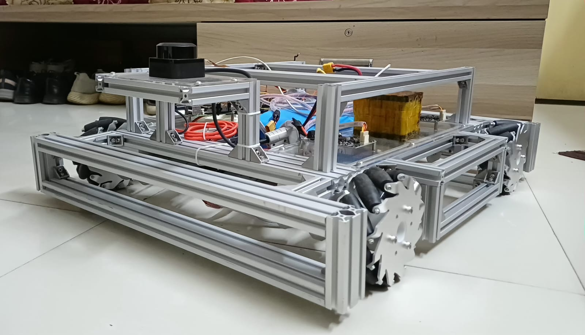
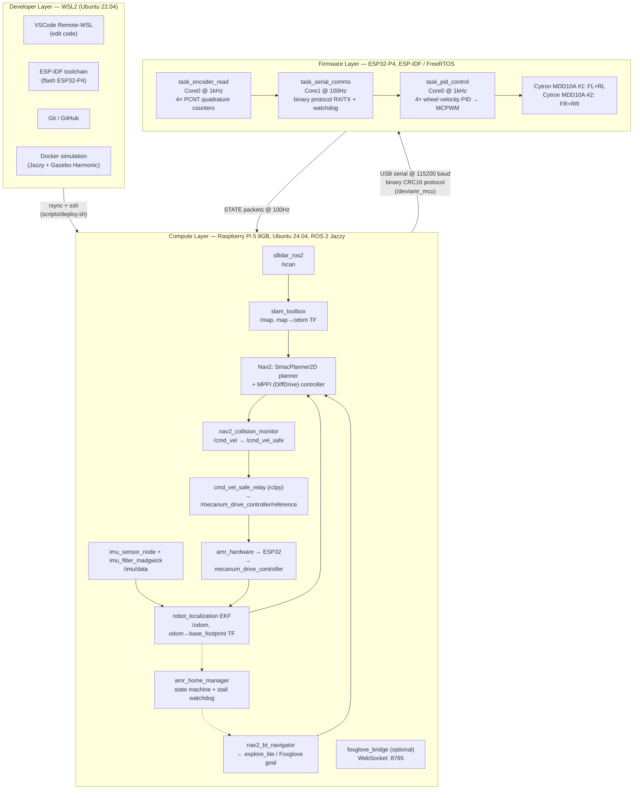
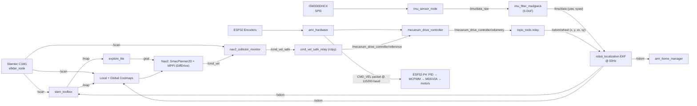
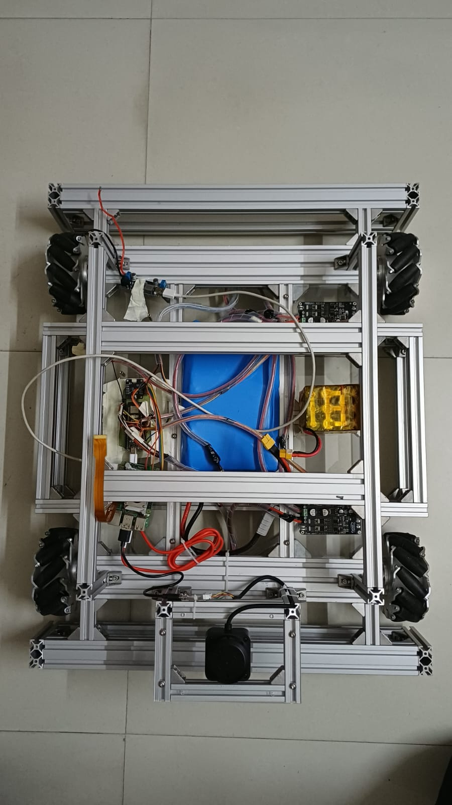
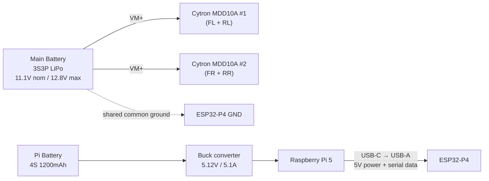
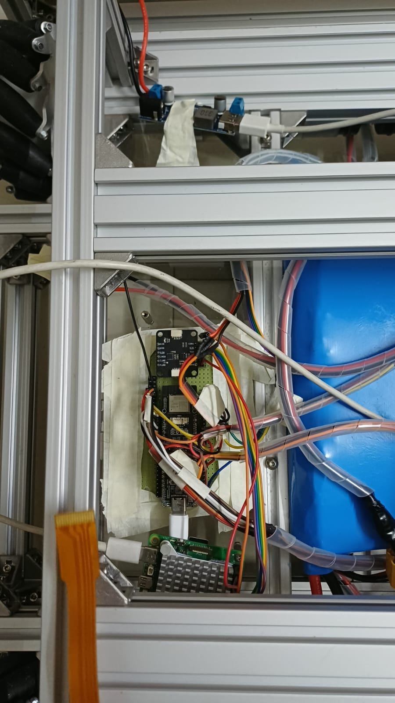
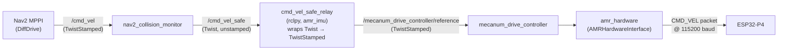
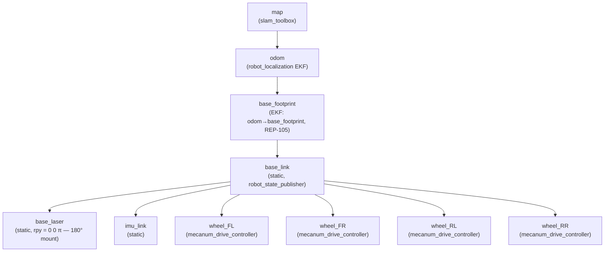
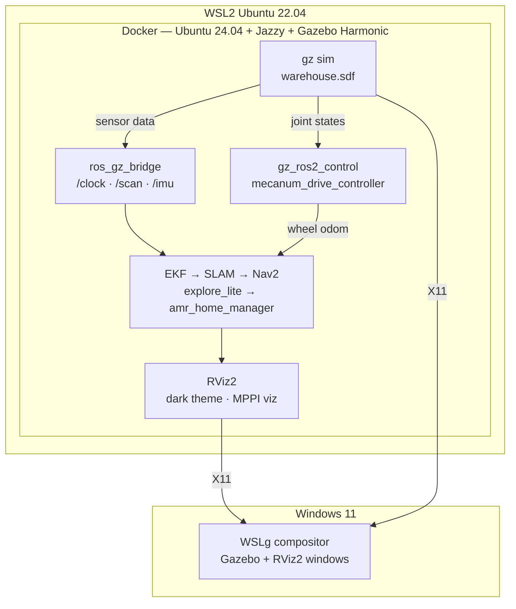
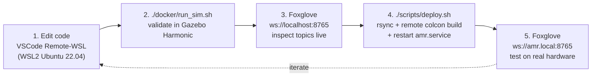

# Aurora — Autonomous Mecanum-Wheel AMR



A ground-up autonomous mobile robot: a 4‑wheel mecanum platform with an
**ESP32‑P4** real-time drivetrain MCU and a **Raspberry Pi 5** running the full
**ROS 2 Jazzy** navigation stack (SLAM, Nav2, frontier exploration, sensor
fusion). Power it on in an unknown room and it will map the space, avoid
obstacles, return to its starting point, and accept click-to-navigate goals —
no human intervention required.

> **Status:** All phases complete. Single-command autonomous exploration is
> working end-to-end on hardware as well as simulation is working end to end. See [Project Status](#project-status) for
> open items.

### Simulation Demo — Gazebo Harmonic

Aurora exploring a warehouse autonomously, building a live SLAM map, and
navigating with MPPI — same ROS 2 stack, zero hardware changes.
Runs on any laptop with Docker + WSL2 via `./scripts/demo_sim.sh`.

**Gazebo + RViz2 — side-by-side live run**

<!-- After uploading to GitHub: drag gazebo+rviz.mp4 into a GitHub Issue/PR comment
     to get the CDN URL, then replace the src below -->
<video src="https://github.com/user-attachments/assets/684b4802-cedb-428f-9818-0a33054b5161" controls width="800"></video>

**RViz2 — SLAM map building live**

<!-- Upload Rviz2.mp4 → GitHub CDN → replace src below -->
<video src="https://github.com/user-attachments/assets/ccdc0130-682b-4605-a604-8a6883a595cb" controls width="800"></video>

**Terminal — ROS 2 stack startup sequence**

<!-- Upload terminal.mp4 → GitHub CDN → replace src below -->
<video src="https://github.com/user-attachments/assets/6818dfd3-2ed1-4580-9f0e-5592629d2627" controls width="800"></video>

---

## Table of Contents

1. [Overview](#overview)
2. [System Architecture](#system-architecture)
3. [Hardware](#hardware)
4. [Repository Layout](#repository-layout)
5. [Firmware — ESP32-P4](#firmware--esp32-p4)
6. [ROS 2 Workspace](#ros-2-workspace)
7. [Getting Started](#getting-started)
8. [Running Aurora](#running-aurora)
9. [Gazebo Simulation](#gazebo-simulation)
10. [Development Workflow](#development-workflow)
11. [Project Status](#project-status)
12. [Key Architectural Decisions](#key-architectural-decisions)
13. [Lessons Learned / Known Gotchas](#lessons-learned--known-gotchas)
14. [Contributors](#contributors)

---

## Overview

**Goal:** Power on the robot in an unknown location. It must:

1. Autonomously explore the entire reachable area, building a complete map
2. Avoid all obstacles throughout exploration and navigation
3. Return to its starting position when exploration is complete
4. Save the map for inspection
5. Accept a user-defined navigation goal (click on map) and drive there safely

The robot is **holonomic** (mecanum wheels) but is currently driven with a
**differential-drive motion model** in Nav2 — a deliberate, validated trade-off
explained in [Key Architectural Decisions](#key-architectural-decisions).

---

## System Architecture



**Note on sensor placement:** the original design put the IMU and a ToF
sensor on the ESP32. Both were moved to the Raspberry Pi during bring-up — the
IMU talks to the Pi directly over SPI0, and the ToF sensor (VL53L5CX) was
**dropped entirely**. The ESP32-P4's scope is now strictly *motors, encoders,
PID, and serial* — see [Key Architectural Decisions](#key-architectural-decisions).

### End-to-End Data Flow



---

## Hardware



| Component | Model | Notes |
|---|---|---|
| Frame | Aluminium extrusion, **71.5 × 56.5 cm**, ~8 kg | Measured (differs from original 75×58.5cm spec) |
| Wheels | 4× 60 mm aluminium mecanum wheels | Wheel radius 0.030 m |
| Motors | 4× **PGM45775-19.2K**, 12 V, 19.2:1 gearbox | 7 PPR quadrature encoder on motor shaft |
| Motor Drivers | 2× **Cytron MDD10A** (dual-channel) | Sign-magnitude PWM, 10 A/ch continuous |
| MCU | **ESP32-P4** (Waveshare ESP32-P4-WIFI6 dev board) | FreeRTOS, ESP-IDF v5.3.x |
| Compute | **Raspberry Pi 5 8GB**, Ubuntu 24.04 | ROS 2 Jazzy, hosts IMU + LiDAR + full stack |
| LiDAR | **Slamtec C1M1 R2** | USB, 460800 baud, DenseBoost auto mode, 10 Hz |
| IMU | **ISM330DHCX** (6-DoF accel+gyro) | SPI0 on Pi 5 @ 500 kHz, mode 0 |
| Main Battery | 3S3P LiPo, 11.1 V nom / 12.8 V max, ~7800 mAh | Powers motors + ESP32 logic |
| Pi Battery | 4S 1200 mAh → buck converter → 5.12 V / 5.1 A | Powers RPi5 (and ESP32 via USB) |

> **Removed from the original design:** the SmartElex VL53L5CX ToF sensor was
> never wired and is fully removed — LiDAR is the sole obstacle-detection
> source. The MMC5983MA magnetometer on the IMU breakout board is present but
> **unused** (DC motor fields corrupt indoor magnetometer readings); the IMU
> filter runs in 6-DoF mode (`use_mag: false`).

### Encoder Resolution

```
7 PPR (motor shaft) × 2 (X2 quadrature, as counted by ESP32 PCNT) × 19.2 (gear ratio)
  = 268.8 counts per output-shaft revolution

RAD_PER_COUNT = 2π / 268.8   (locked in amr_hardware_interface.hpp)
```

This value was the root cause of a major odometry/SLAM debugging session — the
firmware counts in **X2** mode, not X4 as originally assumed. See
[Lessons Learned](#lessons-learned--known-gotchas).

### Mecanum Geometry (locked, measured)

| Parameter | Value | Used in |
|---|---|---|
| `wheel_separation_x` (front↔rear axle) | 0.462 m | `amr.urdf.xacro` (`lx = 0.231`) |
| `wheel_separation_y` (left↔right track) | 0.510 m | `amr.urdf.xacro` (`ly = 0.255`) |
| `sum_of_robot_center_projection_on_X_Y_axis` | 0.486 | `controllers.yaml` |
| `wheel_radius` | 0.030 m | `controllers.yaml` |
| Wheel velocity command limits | ±37.6 rad/s (≈ ±1.13 m/s rim speed) | `amr.urdf.xacro` |

### ESP32-P4 GPIO Map (physically verified)

**Motors (MCPWM, 20 kHz):**

| Wheel | PWM GPIO | DIR GPIO | MCPWM Group |
|---|---|---|---|
| FL | 5  | 26 | 0 |
| FR | 33 | 2  | 0 |
| RL | 32 | 27 | 0 |
| RR | 52 | 4  | 1 |

**Encoders (PCNT quadrature, X2):**

| Wheel | A pin | B pin |
|---|---|---|
| FL | 48 | 46 |
| FR | 49 | 47 |
| RL | 50 | 3  |
| RR | 51 | 7  |

> GPIO 14–17 from the original design are **not exposed** on this board.
> Avoid GPIO 9–13 (audio codec I2S — actively driven), 18–23 (SDIO), and
> 24–25 (USB OTG D+/D-) when adding new peripherals.

### IMU Wiring (Raspberry Pi 5, 40-pin header → ISM330DHCX, SPI0/CE0)

| Pi 5 Pin | Function | IMU Pin |
|---|---|---|
| 17 | 3.3V | VCC |
| 20 | GND | GND |
| 19 | MOSI | SDA/SDI |
| 21 | MISO | SDO |
| 23 | SCLK | SCL |
| 24 | CE0 | CS/CSB |

### Power Rails



> ESP32-P4 GND and both MDD10A grounds **must** share the same negative
> terminal as the main battery — isolated grounds caused undefined logic
> levels on PWM/DIR pins early in bring-up.

---

## Repository Layout

```
AMR/
├── firmware/                    # ESP32-P4 ESP-IDF project (drivetrain MCU)
│   ├── main/
│   │   ├── main.c               # Task creation, hardware init
│   │   ├── motor.c / .h         # MCPWM init, set_duty()
│   │   ├── encoder.c / .h       # PCNT quadrature decoder, 4 units
│   │   ├── pid.c / .h           # Generic PID with anti-windup
│   │   ├── shared_state.h       # Mutex-protected state shared between tasks
│   │   └── tasks/
│   │       ├── task_encoder_read.c
│   │       ├── task_pid_control.c
│   │       └── task_serial_comms.c
│   └── components/
│       ├── serial_protocol/     # Binary frame encode/decode + CRC16 (+ unit tests)
│       ├── ism330dhcx/          # Unused — IMU now lives on the Pi (legacy component)
│       └── vl53l5cx/            # Unused — ToF sensor removed (legacy component)
│
├── ros2_ws/src/                 # ROS 2 Jazzy workspace
│   ├── amr_description/         # URDF/xacro, sensor frames, Gazebo sim plugins
│   ├── amr_hardware/             # ros2_control SystemInterface — serial bridge to ESP32
│   ├── amr_imu/                  # ISM330DHCX SPI driver + cmd_vel relay nodes
│   ├── amr_sensor_fusion/        # imu_filter_madgwick + robot_localization EKF
│   ├── amr_slam/                 # slam_toolbox online_async config
│   ├── amr_nav/                  # Nav2: planner, controller, costmaps, collision_monitor
│   ├── amr_explore/               # explore_lite (m-explore-ros2) frontier config
│   ├── amr_home_manager/          # State machine: explore → save map → return home
│   └── amr_bringup/                # Top-level launch files & shared configs
│
├── docker/                       # Ubuntu 24.04 + Jazzy + Gazebo Harmonic simulation image
├── scripts/                       # setup_espidf.sh, setup_rpi5.sh, deploy.sh, udev rules
├── teleop/                        # Standalone keyboard teleop over raw serial
├── tools/                          # IMU SPI diagnostics, map cleanup utility
└── docs/
    ├── project_log.md             # Full chronological build/debug log (33 sections)
    └── superpowers/specs/          # Original system design spec (2026-05-17)
```

---

## Firmware — ESP32-P4



The firmware is intentionally narrow in scope: **encoder capture, wheel
velocity PID, serial protocol, and a hardware watchdog E-stop.** All
ROS-native sensor processing (IMU, LiDAR) happens on the Raspberry Pi.

### FreeRTOS Task Layout

| Task | Core | Priority | Rate | Responsibility |
|---|---|---|---|---|
| `task_encoder_read` | 0 | 9 | 1 kHz | Atomically snapshot 4× PCNT counters |
| `task_pid_control` | 0 | 10 | 1 kHz | 4× independent wheel velocity PID → MCPWM duty |
| `task_serial_comms` | 1 | 8 | 100 Hz | Parse RX commands, send STATE packets, run watchdog |

Real-time tasks (encoder + PID) are pinned to Core 0 and never blocked by I/O.
Shared state (`g_state` in `shared_state.h`) is protected by a FreeRTOS mutex.

### Serial Packet Protocol

All packets share one frame, validated by CRC16 over `TYPE+LEN+PAYLOAD`:

```
[0xAA][0x55][TYPE:1][LEN:1][PAYLOAD:LEN bytes][CRC16_HI][CRC16_LO]
```

| Type | Code | Direction | Payload | Status |
|---|---|---|---|---|
| `CMD_VEL` | `0x01` | Host → MCU | 4× `float32` wheel ω (rad/s), FL/FR/RL/RR | **active** |
| `STATE` | `0x02` | MCU → Host, 100 Hz | `timestamp_ms` (u32) + 4× `int32` encoder deltas | **active** |
| `HEARTBEAT` | `0x04` | Host → MCU | — | **active** |
| `PARAM_SET` | `0x05` | Host → MCU | `param_id` (u8) + `value` (f32) | reserved (defined, not yet wired) |
| `DIAGNOSTICS` | `0x06` | MCU → Host | `batt_mv` (u16) + `error_flags` (u8) | reserved (defined, not yet wired) |

**Transport:** USB CDC-ACM at **115200 baud** (`/dev/amr_mcu`, CH343P bridge,
VID:PID `1a86:55d3`). The driver uses `uart_driver_install()` +
`uart_read_bytes()`/`uart_write_bytes()` directly — bypassing the ESP-IDF VFS,
which deadlocks if `fread(stdin)`/`fwrite(stdout)` are used concurrently on
the console UART.

**Watchdog:** if no `HEARTBEAT` is received for **2 seconds**, the firmware
zeroes all wheel setpoints, resets PID integrators, stops all motors, and sets
`error_flags` bit 0 — independent of ROS 2 state.

### Wheel Velocity PID

Each of the 4 wheels runs an independent PID loop at 1 kHz:

```c
pid_init(&s_pid[i], /*Kp=*/0.12f, /*Ki=*/0.3f, /*Kd=*/0.0f,
         /*dt=*/0.001f, /*out_min=*/-0.45f, /*out_max=*/0.45f);
```

- **Kp = 0.12** — clears stiction reliably without saturating
- **Ki = 0.3** — handles load variation; integrator clamped (anti-windup) when output saturates
- **Kd = 0** — measured ω is too noisy for a useful derivative term
- **Output clamp ±0.45** (45% duty) — safe for sustained driver operation
- **Setpoint deadband 0.1 rad/s** — below this, the wheel is commanded to zero (prevents drift/heat)

### Building & Flashing

```bash
# One-time setup on WSL2 (installs ESP-IDF v5.3.x for esp32p4)
./scripts/setup_espidf.sh
get_idf   # alias added to ~/.bashrc by the script above

cd firmware
idf.py set-target esp32p4
idf.py -p /dev/ttyACM0 build flash monitor
```

PID gains are currently compile-time constants — `PARAM_SET` (0x05) is defined
in the protocol for future runtime tuning but not yet handled by
`task_serial_comms`.

> **History:** the firmware went through an Arduino sketch (initial teleop
> bring-up), then a full ESP-IDF rewrite that survived a 2-day boot-hang
> debugging saga (resolved by a clean `idf.py fullclean` rebuild) and a USB
> CDC-vs-JTOG / VFS deadlock investigation. The `ism330dhcx` and `vl53l5cx`
> firmware components are leftovers from before the IMU/ToF-to-Pi
> architecture pivot — they are **not** referenced by `firmware/main/CMakeLists.txt`
> and are not part of the shipping firmware. Full history in
> [`docs/project_log.md`](docs/project_log.md) (Sections 7–25).

---

## ROS 2 Workspace

**Target:** ROS 2 **Jazzy Jalisco** on Ubuntu 24.04 (Raspberry Pi 5 and Docker
simulation). Build with `colcon build --symlink-install`.

### Packages

| Package | Build Type | Description |
|---|---|---|
| [`amr_description`](ros2_ws/src/amr_description) | ament_cmake | URDF/xacro robot model, sensor frames, Gazebo sim plugins |
| [`amr_hardware`](ros2_ws/src/amr_hardware) | ament_cmake | `ros2_control` `SystemInterface` plugin — serial bridge to the ESP32-P4 |
| [`amr_imu`](ros2_ws/src/amr_imu) | ament_python | ISM330DHCX SPI driver (`/imu/data_raw`) + `cmd_vel_safe_relay` / `twist_to_reference` bridges |
| [`amr_sensor_fusion`](ros2_ws/src/amr_sensor_fusion) | ament_cmake | `imu_filter_madgwick` + `robot_localization` EKF → `/odom` |
| [`amr_slam`](ros2_ws/src/amr_slam) | ament_cmake | `slam_toolbox` online_async mapping config |
| [`amr_nav`](ros2_ws/src/amr_nav) | ament_cmake | Nav2: `SmacPlanner2D` planner, MPPI (DiffDrive) controller, costmaps, `collision_monitor` |
| [`amr_explore`](ros2_ws/src/amr_explore) | ament_cmake | `explore_lite` (m-explore-ros2) frontier-exploration config |
| [`amr_home_manager`](ros2_ws/src/amr_home_manager) | ament_python | State machine: record home → explore → stall watchdog → save map → return home |
| [`amr_bringup`](ros2_ws/src/amr_bringup) | ament_cmake | Top-level launch files and shared runtime configs |

> `m-explore-ros2` (`robo-friends/m-explore-ros2`) is **not vendored** — it is
> not available as a Jazzy apt package and must be cloned + built from source
> directly in `ros2_ws/src/` on the Raspberry Pi (`.gitignore`'d).

### The `cmd_vel` Chain



`topic_tools relay`/`transform` were tried and **do not work** for this chain
— see [Lessons Learned](#lessons-learned--known-gotchas).

### TF Tree



### Key Topics

| Topic | Type | Rate | Producer | Consumers |
|---|---|---|---|---|
| `/scan` | `LaserScan` | 10 Hz | `sllidar_node` | slam_toolbox, costmaps, collision_monitor |
| `/imu/data_raw` | `Imu` | 100 Hz | `imu_sensor_node` (SPI, gyro-bias-calibrated at boot) | `imu_filter_madgwick` |
| `/imu/data` | `Imu` | 100 Hz | `imu_filter_madgwick` (6-DoF, no magnetometer) | EKF |
| `/mecanum_drive_controller/odometry` | `Odometry` | 50 Hz | `mecanum_drive_controller` | relayed → `/odom/wheel` |
| `/odom/wheel` | `Odometry` | 50 Hz | `topic_tools relay` | EKF (x, y, vx, vy only — yaw OFF) |
| `/odom` | `Odometry` | 50 Hz | EKF (`ekf_filter_node`) | Nav2, `amr_home_manager` |
| `/map` | `OccupancyGrid` | ~1 Hz | `slam_toolbox` | global costmap, `explore_lite` |
| `/explore/status` | `explore_lite_msgs/ExploreStatus` | event | `explore_lite` | `amr_home_manager` (drives `IDLE↔EXPLORING`, retry-on-complete) |
| `/cmd_vel` | `TwistStamped` | 20 Hz | MPPI controller | `collision_monitor` |
| `/cmd_vel_safe` | `Twist` | 20 Hz | `collision_monitor` | `cmd_vel_safe_relay` |
| `/mecanum_drive_controller/reference` | `TwistStamped` | 20 Hz | `cmd_vel_safe_relay` | `mecanum_drive_controller` |
| `/explore/resume` | `Bool` | event | `amr_home_manager` | `explore_lite` (pause/resume + stall recovery) |
| `/amr/command` | `String` | event | operator | `amr_home_manager` (`explore` / `stop` / `go_home` / `resume`) |

### Sensor Fusion (EKF)

`robot_localization` fuses two sources at **50 Hz**:

- **`/odom/wheel`** — position only (x, y, vx, vy). Yaw and vyaw are
  **disabled** — mecanum roller slip makes wheel-derived heading too noisy.
- **`/imu/data`** — yaw and vyaw only, from the Madgwick-filtered IMU
  (gravity-vector stabilized, gyro-bias-calibrated at boot).

This split ("IMU is the sole yaw source") was the fix for a map-smearing bug
where wheel and IMU yaw estimates fought each other.

### SLAM

`slam_toolbox` runs in **permanent online_async mapping mode** — the map never
transitions to a "localization" mode and stays live for the entire session.
Tuned for small rooms: `resolution: 0.05`, `minimum_travel_distance: 0.1`,
`minimum_travel_heading: 0.1`, `map_update_interval: 1.0`,
`do_loop_closing: true` (Ceres solver).

### Navigation (Nav2)

| Component | Choice | Why |
|---|---|---|
| Global planner | `SmacPlanner2D` | Plain 8-connected grid search, zero kinematic assumptions — always trackable by the controller |
| Local controller | MPPI, `motion_model: DiffDrive` | Predictable rotate-then-drive-straight motion; `vy_*` zeroed |
| Costmap inflation | 0.45 m (local), 0.45 m (global), `cost_scaling_factor: 3.5` | Tuned for small-room navigation |
| `robot_radius` | 0.30 m (virtual circle) | Avoids "start occupied" false positives vs. the full footprint polygon |
| Safety layer | `nav2_collision_monitor` (`FootprintApproach` polygon, `/scan`) | Independent of costmap cycle — operates on raw scan data |
| Lifecycle | `bond_timeout: 0.0`, `autostart: True` | Pi 5 startup CPU load caused false bond failures with the 4 s default |

### Autonomous Exploration

`explore_lite` (m-explore-ros2) drives frontier selection; `amr_home_manager`
is a Python state machine (`IDLE → EXPLORING ⇄ STUCK`, plus `RETURNING_HOME`
and `RESUMING` for path retrace) that tracks `explore_lite`'s own
`/explore/status` announcements (it starts itself autonomously on launch —
`home_manager` follows along rather than waiting for a command):

- **`IDLE → EXPLORING`**: triggered by `explore_lite`'s own
  `EXPLORATION_STARTED`/`EXPLORATION_IN_PROGRESS` status, or by
  `/amr/command = "explore"`. Seeds the recorded path with the current
  `/odom` pose as "home".
- **Persistent retry on "no frontiers found":** `home_manager` never gives up
  on its own. On `EXPLORATION_COMPLETE` it waits a **2 s debounce**, then
  re-publishes `/explore/resume = True` — the debounce prevents a busy-loop
  against `explore_lite`'s synchronous `makePlan()` when the costmap hasn't
  changed (e.g. robot stopped at a wall).
- **Continuous path recording:** while `EXPLORING`/`STUCK`, samples
  `(x, y, yaw)` from `/odom` every 0.5 m.
- **`STUCK`:** the stall watchdog (`|vx|,|vy|,|wz| < 0.02` for 15 s) nudges
  `/explore/resume`; after **15 nudges** with still no motion, escalates to
  `STUCK` and logs a prompt for the operator to send `stop` or `go_home`.
- **`/amr/command = "stop"`** → saves the recorded path (`<map_save_path>_path.json`)
  and calls `slam_toolbox/save_map` (→ `explore_map.pgm`/`.yaml`), then → `IDLE`.
- **`/amr/command = "go_home"`** → saves progress, then retraces the recorded
  path **in reverse** via sequential `NavigateToPose` waypoints back to the
  home pose, then → `IDLE`. Falls back to a single direct goal if the path
  has ≤1 point.
- **`/amr/command = "resume"`** → pauses `explore_lite`, retraces the path
  **forward** from home to the saved breakpoint, resets stall-watchdog state,
  then re-publishes `/explore/resume = True` and → `EXPLORING`.
- Reentrant `go_home`/`resume` calls while already mid-retrace are safe no-ops
  (logged, not errors).

Validated live on the Pi: the 2 s debounce eliminated a ~20 ms busy-loop when
the robot stopped against a wall, and `stop` correctly transitions to `IDLE`
and saves both the map and path JSON (`map_save_path` is expanded from `~`
before any file I/O).

---

## Getting Started

### Three Environments

| Environment | OS | Role |
|---|---|---|
| **WSL2** (dev) | Ubuntu 22.04 | Edit code, flash ESP32-P4, git |
| **Docker** (sim) | Ubuntu 24.04 + Jazzy + Gazebo Harmonic | Simulate before deploying |
| **Raspberry Pi 5** (deploy) | Ubuntu 24.04 + Jazzy | Real hardware |

### 1. ESP32-P4 Toolchain (WSL2)

```bash
./scripts/setup_espidf.sh     # installs ESP-IDF v5.3.x for esp32p4
```

### 2. Raspberry Pi 5 Setup

Run once on a fresh Ubuntu 24.04 install:

```bash
./scripts/setup_rpi5.sh
```

This installs ROS 2 Jazzy + Nav2/SLAM/EKF/imu_tools/ros2_control packages,
sets up `~/amr_ws`, installs the udev rules, and sets `ROS_DOMAIN_ID=42`.

### 3. udev Rules (stable device names)

[`scripts/udev/99-amr.rules`](scripts/udev/99-amr.rules) maps:

| Device | VID:PID | Symlink |
|---|---|---|
| Slamtec C1M1 R2 LiDAR (CP210x) | `10c4:ea60` | `/dev/lidar` |
| ESP32-P4 (CH343P USB-serial) | `1a86:55d3` | `/dev/amr_mcu` |

### 4. Build the ROS 2 Workspace

```bash
cd ros2_ws
colcon build --symlink-install --cmake-args -DCMAKE_BUILD_TYPE=Release
source install/setup.bash
```

### 5. Deploy from WSL2 → Pi

```bash
./scripts/deploy.sh   # rsync src/ → Pi, colcon build, restart amr.service
```

### Simulation (Docker)

```bash
./docker/run_sim.sh   # Ubuntu 24.04 + Jazzy + Gazebo Harmonic, --network host
ros2 launch amr_bringup explore_map.launch.py use_sim:=true
```

The sim/real boundary is a single xacro switch in `amr.urdf.xacro`
(`gz_ros2_control/GazeboSimSystem` vs `amr_hardware/AMRHardwareInterface`) —
everything above `ros2_control` (Nav2, SLAM, EKF, exploration) is identical.

---

## Running Aurora

### Launch Files (`amr_bringup/launch/`)

| Launch file | What it brings up |
|---|---|
| **`explore_map.launch.py`** | **Primary entry point.** Hardware + IMU + EKF + LiDAR + SLAM + Nav2 + `explore_lite` + `amr_home_manager`. Single command for full autonomous operation. |
| `amr.launch.py` | Same full stack as above, with `foxglove_bridge` enabled by default |
| `teleop_map.launch.py` | Hardware + IMU + EKF + LiDAR + SLAM (no Nav2/explore) — manual keyboard mapping |
| `hardware.launch.py` | Hardware + IMU + EKF only — no LiDAR/SLAM/Nav2 |
| `odom_test.launch.py` | Hardware only — minimal, for encoder/odometry calibration |

### Quick Start — Full Autonomous Run

```bash
# On the Raspberry Pi 5 (or via the systemd amr.service)
ros2 launch amr_bringup explore_map.launch.py
```

> **Important:** start the robot **≥1 m from any wall**. The 0.30 m
> `robot_radius` + 0.45 m inflation radius will mark the robot's own starting
> cell as lethal ("start occupied") if it begins too close to an obstacle.

While exploring:

```bash
# Monitor
ros2 topic hz /cmd_vel
ros2 topic echo /map_metadata --once

# Stop exploration & save the map
ros2 topic pub /amr/command std_msgs/msg/String "data: 'stop'" --once
# → ~/AMR/maps/explore_map.pgm / .yaml

# Return to the recorded home pose
ros2 topic pub /amr/command std_msgs/msg/String "data: 'go_home'" --once
```

Optional flags: `foxglove:=true` (Foxglove bridge on `:8765`, ~15% extra Pi
CPU), `map_save_path:=<path>`.

### Foxglove Studio

Connect to `ws://amr.local:8765`. Useful panels: `/map` (3D), `/scan`,
`/odom`, `/explore/frontiers`, and a Publish action on `/goal_pose`
(`geometry_msgs/PoseStamped`) for click-to-navigate.

### Manual Teleop

```bash
python3 teleop/teleop.py            # direct serial keyboard control
# or, with the ROS2 stack up:
ros2 run teleop_twist_keyboard teleop_twist_keyboard --ros-args -r /cmd_vel:=/cmd_vel_safe
```

---

## Gazebo Simulation

A full-fidelity warehouse simulation using **Gazebo Harmonic** inside Docker —
the identical ROS 2 stack as the real robot, zero code changes.

```bash
./scripts/demo_sim.sh   # builds Docker image + workspace if needed, then launches
```

Aurora will start exploring autonomously after ~25 s. Use the **Nav2 Goal** tool
in RViz2 to send click-to-navigate goals after exploration completes.

### What the sim includes

- 20 × 20 m warehouse with 15 shelves, 5 boxes, 6 pallets, 4 pillars, safety floor stripes, and 6 overhead lights
- 3 walking human actors (MPPI obstacle avoidance targets)
- Simulated Slamtec LiDAR, ISM330DHCX IMU, and mecanum wheel odometry via `gz_ros2_control`
- Full Nav2 autonomous exploration → live SLAM map → return home

### Architecture



### Sim vs. Real hardware

| | Real Robot | Simulation |
|---|---|---|
| EKF yaw source | IMU (Madgwick 6-DoF) | Wheel odom — sim IMU has no magnetometer so Madgwick can't correct yaw drift |
| Nav2 max speed | 0.10 m/s | 0.35 m/s |
| Costmap inflation | 0.45 m | 0.30 m |
| Progress checker | 0.5 m / 10 s | 0.2 m / 30 s |

All overrides are injected at runtime in `sim.launch.py` via `OpaqueFunction` —
`nav2_params.yaml` (real hardware config) is never modified.

---

## Development Workflow



- **Never SSH directly to the Pi for iteration** — push from WSL2, deploy via
  `deploy.sh`, read results back through Foxglove/logs.
- Validate Python/YAML syntax locally before deploying:
  `python3 -c "import ast; ast.parse(open('file.py').read())"`
- Run the `amr_home_manager` test suite locally:
  `PYTEST_DISABLE_PLUGIN_AUTOLOAD=1 python3 -m pytest ros2_ws/src/amr_home_manager`
- `colcon build` and `ros2 launch` only run on the Pi (or in the Docker sim).

### Diagnostic Tools

| Tool | Purpose |
|---|---|
| `tools/imu_spi_check.py` | SPI speed ladder test (50/100/200/500/1000 kHz) for the ISM330DHCX |
| `tools/imu_raw_data.py` | Live accel/gyro stream for sanity-checking the IMU |
| `tools/map_cleaner.py` | Removes speckle-noise clusters from saved `.pgm` maps |
| `odom_test.launch.py` | Hardware-only launch for motor-driven odometry distance checks |

---

## Project Status

**Working and validated end-to-end:**

- Single-command autonomous stack: `ros2 launch amr_bringup explore_map.launch.py`
- Encoder odometry accurate (verified ~0.51 m reported for 0.5 m commanded travel)
- IMU yaw drift eliminated via boot-time gyro bias calibration
- LiDAR scan orientation correct, TF tree coherent (`odom→base_footprint→base_link→...`)
- `SmacPlanner2D` + DiffDrive MPPI — no "no valid path found" failures in recent runs
- Robot reaches frontiers; `cmd_vel` correctly drives the mecanum base
- `amr_home_manager` resilient state machine — persistent retry on "no
  frontiers found" (2 s debounce, no busy-loop), `STUCK` escalation after 15
  failed stall-watchdog nudges, continuous path recording, `stop`/`go_home`/`resume`
  retrace — **58/58 tests passing**
- Map + path save wired to `slam_toolbox/save_map` + `<map_save_path>_path.json`
  (`map_save_path` correctly expands `~` before file I/O)
- `stop` validated live on the Pi: → `IDLE`, map + path saved
- 2 s no-frontiers debounce validated live: eliminates a ~20 ms busy-loop at walls

**Open items:**

- **`go_home` / `resume` path retrace** — implemented and unit-tested, not yet
  exercised end-to-end on the Pi
- **`explore_lite` empty-frontier race condition** — the persistent-retry loop
  recovers from it, but the root cause lives in third-party
  (non-vendored) `m-explore-ros2` code
- **"Start occupied" at launch** if the robot begins within ~1 m of a wall —
  environmental, not a code bug
- `start_with_rotations: true` in `explore.yaml` is a confirmed no-op in this
  build — flagged for cleanup
- MPPI is improved but occasionally still slightly lurchy on the Pi 5
  (`batch_size: 1000`, `time_steps: 40`)
- Occasional `slam_toolbox/save_map` "Failed to spin map subscription" error
  under load — likely transient, needs a retry-when-idle confirmation

---

## Key Architectural Decisions

| Decision | Choice | Why |
|---|---|---|
| Sensor placement | IMU (SPI) + LiDAR (USB) on the Pi; only motors/encoders on the ESP32 | Keeps the MCU strictly real-time; sensors are ROS-native on the Pi |
| ToF sensor | Removed entirely | Never wired; LiDAR covers all obstacle detection |
| Magnetometer | Unused (6-DoF Madgwick) | DC motor current corrupts indoor magnetic readings |
| Encoder scale | `RAD_PER_COUNT = 2π/268.8` (X2 counting) | Firmware PCNT counts X2, not X4 — was 2× under-scaling all odometry |
| EKF yaw source | IMU only; wheel odom yaw/vyaw OFF | Mecanum roller slip made wheel yaw fight the IMU, smearing the map |
| TF tree | EKF publishes `odom→base_footprint`, not `base_link` | `robot_state_publisher` already owns the static `base_footprint→base_link`; REP-105 |
| `cmd_vel_safe` bridging | Custom rclpy node, not `topic_tools relay` | `topic_tools` drops messages due to QoS mismatch with the chainable controller |
| Motion model | MPPI `DiffDrive`, not `Omni` | `Omni` + `PathAngleCritic` fought each other, causing diagonal/oscillating motion |
| Global planner | `SmacPlanner2D`, not `SmacPlannerLattice` | Lattice primitives assumed holonomic motion, incompatible with DiffDrive in tight spaces |
| `explore_lite` control | `/explore/resume` (Bool) owned by `amr_home_manager` | The only first-party lever into a non-vendored third-party node |
| Map save | `slam_toolbox/save_map` service call | A topic-publish version was a silent no-op (no subscriber) |
| Lifecycle managers | `bond_timeout: 0.0`, `autostart: True` | Pi 5 startup load caused false bond failures with defaults |

---

## Lessons Learned / Known Gotchas

- **Hand-pushing the robot to test odometry is invalid** — mecanum rollers
  skid sideways under hand pressure. Only motor-driven motion (teleop or
  commanded velocity, e.g. via `odom_test.launch.py`) gives valid odom/SLAM
  calibration data.
- **Madgwick `zeta` cannot fix yaw drift** in 6-DoF (`use_mag: false`) mode —
  it's only informed by the accelerometer's gravity vector, which has zero
  yaw component. Yaw drift was fixed by calibrating the gyro's zero-rate
  offset at boot (200-sample average).
- **`topic_tools relay`/`transform`** fail for `cmd_vel`-related bridging in
  Jazzy: `transform` crashes if the input topic has no publisher yet at
  startup, and `relay`'s QoS doesn't match the chainable controller's
  `reference` subscriber. Always use a typed rclpy node.
- **`PathAngleCritic` + MPPI `Omni` motion model fight each other** — the
  critic penalizes non-forward orientation while `Omni` encourages lateral
  strafing. `PathAngleCritic` is correct *only* with `DiffDrive`.
- **`SmacPlannerLattice` + `DiffDrive`** produces "no valid path found" once
  the map fills in enough that lattice-only paths require holonomic motion
  through tight corridors.
- **`use_lifecycle_manager: false` in `slam_toolbox.yaml` does not work** in
  Jazzy's slam_toolbox 2.8.4 — it stays `unconfigured` forever without an
  actual `nav2_lifecycle_manager` node with `autostart: True`.
- **`default_nav_to_pose_bt_xml: ""`** does NOT resolve to Jazzy's built-in
  default BT — it must be injected explicitly via `OpaqueFunction` with the
  real path to `navigate_to_pose_w_replanning_and_recovery.xml`.
- **`plugin_lib_names` must NOT be set** in Jazzy's `bt_navigator` — it
  registers all standard BT nodes internally; setting it causes a FATAL
  duplicate-registration crash.
- **`explore_lite` only applies its YAML params if the node is named to match
  the YAML's top-level key** (`explore:` → node name must be `explore`, not
  `explore_node`).
- **URDF/xacro comments must avoid `--` and `: ` (colon-space)** — `--` breaks
  xacro's XML parser; `: ` sequences that survive into `robot_description`
  break `launch_ros`'s YAML type-inference for that parameter.
- **`start_with_rotations: true`** in `explore.yaml` is a confirmed no-op in
  this build of `m-explore-ros2`.

Full chronological detail for all of the above lives in
[`docs/project_log.md`](docs/project_log.md) (33 sections).

---

## Author

Designed, built, and developed end-to-end by **Mohammed Rayan** ([@mohammedryn](https://github.com/mohammedryn)) — hardware, firmware, and the full ROS 2 stack.
