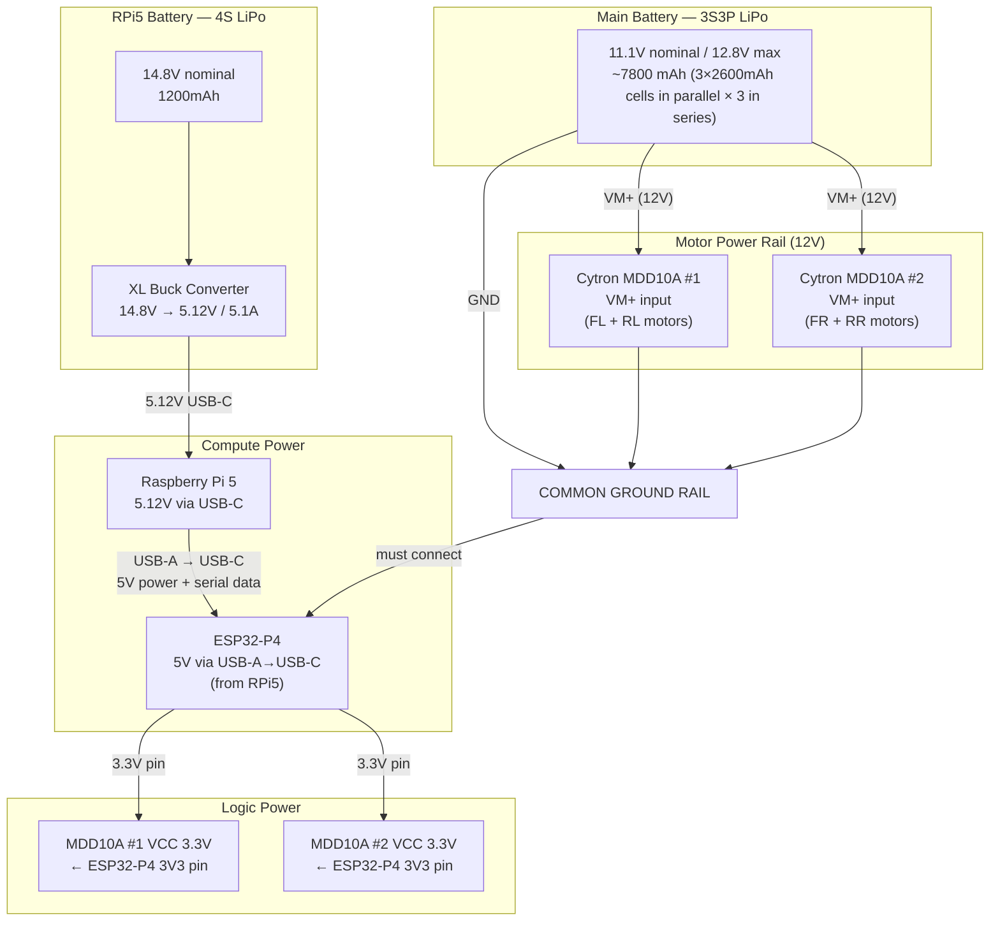
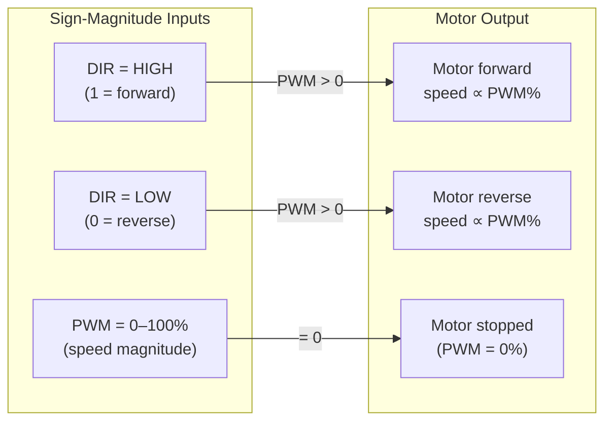
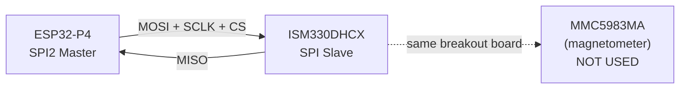
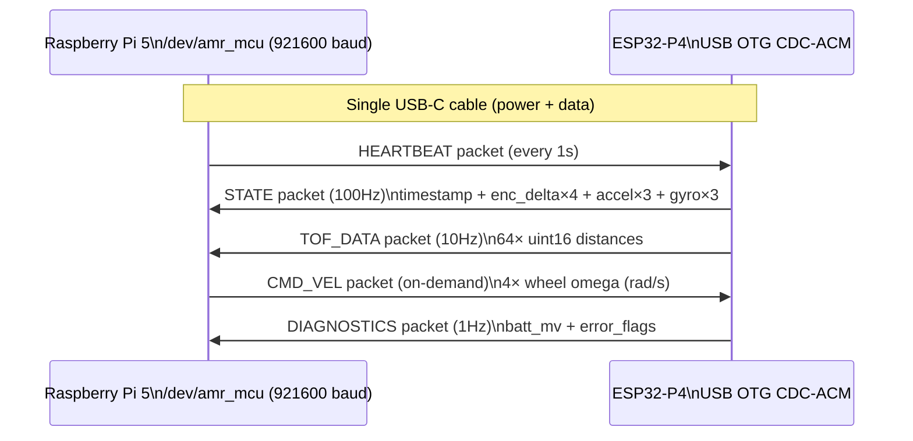
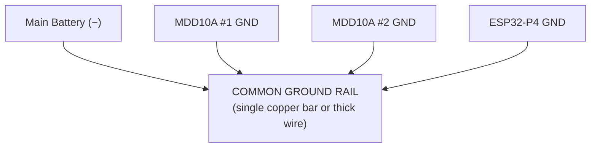

# AMR Electrical Reference

**Autonomous Mobile Robot — Complete Electrical & Hardware Reference**
*Ground truth for wiring, power, GPIO assignments, and hardware interfaces.*

---

## Table of Contents

1. [Hardware Inventory](#1-hardware-inventory)
2. [System Power Architecture](#2-system-power-architecture)
3. [Motor System](#3-motor-system)
   - [Motors & Encoders](#31-motors--encoders)
   - [Cytron MDD10A Motor Drivers](#32-cytron-mdd10a-motor-drivers)
   - [Sign-Magnitude Control Mode](#33-sign-magnitude-control-mode)
4. [ESP32-P4 GPIO Assignments](#4-esp32-p4-gpio-assignments)
   - [Actual Firmware GPIO (Source of Truth)](#41-actual-firmware-gpio-source-of-truth)
   - [Why These GPIOs Were Chosen](#42-why-these-gpios-were-chosen)
5. [Sensor Interfaces](#5-sensor-interfaces)
   - [IMU — ISM330DHCX (SPI)](#51-imu--ism330dhcx-spi)
   - [ToF — VL53L5CX (I2C)](#52-tof--vl53l5cx-i2c)
   - [LiDAR — Slamtec C1M1 R2 (USB)](#53-lidar--slamtec-c1m1-r2-usb)
6. [Serial Link — ESP32 ↔ Raspberry Pi 5](#6-serial-link--esp32--raspberry-pi-5)
7. [Common Ground Rule](#7-common-ground-rule)
8. [udev Rules — Stable Device Names](#8-udev-rules--stable-device-names)
9. [Full Wiring Diagram](#9-full-wiring-diagram)
10. [Encoder Resolution & Motor Math](#10-encoder-resolution--motor-math)
11. [Connector & Cable Reference](#11-connector--cable-reference)
12. [Open Measurements Required](#12-open-measurements-required)

---

## 1. Hardware Inventory

| Component | Model | Qty | Role | Key Specs |
|---|---|---|---|---|
| Frame | Aluminium extrusion | 1 | Chassis | 75 × 58.5 cm |
| Wheels | 60mm aluminium mecanum | 4 | Holonomic motion | 30mm radius |
| Motors | PGM45775-19.2K (12V) | 4 | Wheel actuation | 19.2:1 gear, ~187 RPM output |
| Encoders | ME-37 | 4 | Wheel odometry | 7 PPR on motor shaft, quadrature |
| Motor Drivers | Cytron MDD10A | 2 | PWM motor driving | Dual-channel, 10A/ch, 6–24V |
| LiDAR | Slamtec C1M1 R2 | 1 | Primary SLAM sensor | 12m range, 360°, 10Hz, USB |
| Compute | Raspberry Pi 5 8GB | 1 | High-level compute | Ubuntu 24.04, ROS2 Jazzy |
| MCU | ESP32-P4 (Waveshare dev board) | 1 | Real-time control | Dual RISC-V, Wi-Fi 6, BT5 |
| IMU | SmartElex 9DoF (ISM330DHCX + MMC5983MA) | 1 | Inertial sensing | 6-axis active (magneto unused) |
| ToF | SmartElex VL53L5CX | 1 | Low-obstacle detection | 8×8 pixel, 4m range, 63°×63° FoV |
| Main Battery | 3S3P LiPo (2600mAh cells) | 1 | Motor + ESP32 power | 11.1V nom / 12.8V max, 7800mAh |
| RPi5 Battery | 4S LiPo 1200mAh + XL buck | 1 | RPi5 power | → 5.12V / 5.1A via USB-C |

> **Motor note:** The design spec originally listed PG36M555-13.7K motors (13.7:1 gear). The firmware `RAD_PER_COUNT` constant was updated in commit 67c6c31 to reflect a **19.2:1 gear** (PGM45775-19.2K). Verify the physical motor label and update firmware if the gear ratio differs.

---

## 2. System Power Architecture

The robot has two completely separate power rails — one for motors, one for compute.



**Why separate batteries?**
- Motor currents cause large voltage spikes on the motor rail. Running the RPi5 on the same rail would cause brownouts and resets.
- The 4S LiPo → buck converter provides a clean, regulated 5.12V rail immune to motor transients.
- The ESP32 takes 5V from the RPi5's USB port (the same cable used for serial communication) — no separate supply needed.

**Voltage summary:**

| Rail | Source | Voltage | Consumers |
|---|---|---|---|
| Motor power | Main 3S3P LiPo | 11.1–12.8V | MDD10A #1, MDD10A #2 |
| Logic VCC | ESP32-P4 3V3 pin | 3.3V | MDD10A VCC pins |
| ESP32 power | RPi5 USB-A | 5V | ESP32-P4 (via USB-C) |
| RPi5 power | 4S LiPo + XL buck | 5.12V | RPi5 only |

---

## 3. Motor System

### 3.1 Motors & Encoders

**Motor: PGM45775-19.2K**
```
Voltage:       12V
Output RPM:    ~187 RPM (at 12V, no load)
Gear ratio:    19.2:1
Encoder:       ME-37, 7 PPR on motor shaft
               7 × 4 (quadrature) × 19.2 = 537.6 counts/output revolution
```

**Wheel layout (top view):**
```
        FRONT
    ╔═══════════╗
    ║  FL    FR ║
    ║  /\  /\  ║   FL = Motor 0 (index 0)
    ║  \/  \/  ║   FR = Motor 1 (index 1)
    ║           ║   RL = Motor 2 (index 2)
    ║  RL    RR ║   RR = Motor 3 (index 3)
    ║  \/  \/  ║
    ║  /\  /\  ║
    ╚═══════════╝
        REAR
```

**Mecanum wheel roller orientation:**
```
FL: rollers at /   FR: rollers at \
RL: rollers at \   RR: rollers at /
```
This orientation is what makes holonomic motion (strafing, diagonal, rotation) possible. The roller angles must match the software kinematics model.

---

### 3.2 Cytron MDD10A Motor Drivers

Two MDD10A boards drive the four motors. Each board has two independent channels.

```
MDD10A #1 — Left-side motors
  Channel 1 (M1): Front-Left  (FL) motor
  Channel 2 (M2): Rear-Left   (RL) motor

MDD10A #2 — Right-side motors
  Channel 1 (M1): Front-Right (FR) motor
  Channel 2 (M2): Rear-Right  (RR) motor
```

**MDD10A connections:**

| Pin | MDD10A #1 | MDD10A #2 |
|---|---|---|
| VM+ | Main battery + | Main battery + |
| GND | Common ground rail | Common ground rail |
| VCC | ESP32-P4 3V3 | ESP32-P4 3V3 |
| PWM1 | GPIO 5 (FL PWM) | GPIO 34 (FR PWM) |
| DIR1 | GPIO 26 (FL DIR) | GPIO 27 (FR DIR) |
| PWM2 | GPIO 35 (RL PWM) | GPIO 45 (RR PWM) |
| DIR2 | GPIO 20 (RL DIR) | GPIO 21 (RR DIR) |
| M1A, M1B | FL motor leads | FR motor leads |
| M2A, M2B | RL motor leads | RR motor leads |

---

### 3.3 Sign-Magnitude Control Mode

Both MDD10A boards are configured in **Sign-Magnitude mode** (jumper or DIP switch setting on the board — verify hardware configuration):



**Firmware implementation** (from `motor.c`):
```c
void motor_set_duty(int idx, float duty) {
    // duty ∈ [-1.0, 1.0]
    gpio_set_level(DIR_GPIO[idx], duty >= 0.0f ? 1 : 0);         // sign → DIR pin
    mcpwm_comparator_set_compare_value(s_cmpr[idx],
        (uint32_t)(fabsf(duty) * PWM_PERIOD));                    // magnitude → PWM
}
```

**PWM parameters:**
```
Frequency:    20 kHz   (inaudible; above human hearing; good for motor inductance)
Resolution:   10 MHz clock → period = 500 ticks
Duty range:   0–500 ticks = 0%–100%
```

---

## 4. ESP32-P4 GPIO Assignments

### 4.1 Actual Firmware GPIO (Source of Truth)

> **Important:** The GPIO assignments below are taken directly from the firmware source files. They differ from the original design spec due to hardware constraints discovered during bring-up (MCPWM vs LEDC, pin conflicts with Waveshare board peripherals).

**Motor PWM (from `motor.c`):**
```c
static const int PWM_GPIO[] = {5, 34, 35, 45};   // FL FR RL RR
static const int DIR_GPIO[] = {26, 27, 20, 21};   // FL FR RL RR
```

**Encoder (from `encoder.c`):**
```c
static const int GPIO_A[] = {48, 49, 50, 51};    // FL FR RL RR — Channel A
static const int GPIO_B[] = {52,  2,  3,  4};    // FL FR RL RR — Channel B
```

**Full GPIO table:**

| GPIO | Signal | Type | Peripheral | Motor/Sensor |
|---|---|---|---|---|
| 5 | FL_PWM | MCPWM output | MCPWM Group 0, Op 0 | FL motor speed |
| 34 | FR_PWM | MCPWM output | MCPWM Group 0, Op 1 | FR motor speed |
| 35 | RL_PWM | MCPWM output | MCPWM Group 0, Op 2 | RL motor speed |
| 45 | RR_PWM | MCPWM output | MCPWM Group 1, Op 0 | RR motor speed |
| 26 | FL_DIR | GPIO output | — | FL motor direction |
| 27 | FR_DIR | GPIO output | — | FR motor direction |
| 20 | RL_DIR | GPIO output | — | RL motor direction |
| 21 | RR_DIR | GPIO output | — | RR motor direction |
| 48 | FL_ENC_A | PCNT input | PCNT unit 0 | FL encoder Ch A |
| 49 | FR_ENC_A | PCNT input | PCNT unit 1 | FR encoder Ch A |
| 50 | RL_ENC_A | PCNT input | PCNT unit 2 | RL encoder Ch A |
| 51 | RR_ENC_A | PCNT input | PCNT unit 3 | RR encoder Ch A |
| 52 | FL_ENC_B | PCNT input | PCNT unit 0 | FL encoder Ch B |
| 2 | FR_ENC_B | PCNT input | PCNT unit 1 | FR encoder Ch B |
| 3 | RL_ENC_B | PCNT input | PCNT unit 2 | RL encoder Ch B |
| 4 | RR_ENC_B | PCNT input | PCNT unit 3 | RR encoder Ch B |
| IMU_MOSI | SPI2 MOSI | SPI | ISM330DHCX | IMU data out |
| IMU_MISO | SPI2 MISO | SPI | ISM330DHCX | IMU data in |
| IMU_SCLK | SPI2 CLK | SPI | ISM330DHCX | IMU clock |
| IMU_CS | GPIO output | SPI CS | ISM330DHCX | Active low |
| TOF_SDA | I2C0 SDA | I2C | VL53L5CX | ToF data |
| TOF_SCL | I2C0 SCL | I2C | VL53L5CX | ToF clock |
| TOF_LPVN | GPIO output | — | VL53L5CX | Power enable |
| USB D+/D− | USB OTG | USB CDC | Serial to RPi5 | Data + 5V power |

> **Verify IMU/ToF GPIOs** against the ISM330DHCX and VL53L5CX component driver source (`firmware/components/ism330dhcx/ism330dhcx.c` and `firmware/components/vl53l5cx/vl53l5cx_drv.c`) — the exact SPI/I2C pin numbers are defined in those drivers.

---

### 4.2 Why These GPIOs Were Chosen

**MCPWM pins {5, 34, 35, 45}** were selected to avoid:
- GPIO 9–13: Audio codec zone on Waveshare board
- GPIO 14–19: Camera/display zone (C6 peripheral) on Waveshare board
- GPIO 28–33: Camera/display zone
- GPIO 46, 47: Exhibited side effects during the LEDC/MCPWM debugging session

**DIR pins {26, 27, 20, 21}** were selected after testing showed {46, 47} had side effects when used alongside LEDC channel configurations.

**Encoder pins {48–52, 2–4}** were selected to avoid all camera/display GPIO banks on the Waveshare ESP32-P4-WiFi6 development board.

**LEDC → MCPWM switch:** The design originally planned LEDC (LED Control peripheral) for PWM. During hardware bring-up, `ledc_channel_config()` for any channel ≥ 1 triggered a deferred AHB bus fault on ESP32-P4 rev v1.3 + ESP-IDF 5.4.1 due to a write to LEDC GAMMA_RAM delivering a deferred exception at the next AHB access. MCPWM (Motor Control PWM) peripheral does not have GAMMA_RAM and does not exhibit this bug. All 4 motors now use MCPWM.

---

## 5. Sensor Interfaces

### 5.1 IMU — ISM330DHCX (SPI)

**Device:** ISM330DHCX — 6-axis IMU (3-axis accelerometer + 3-axis gyroscope)  
**Interface:** SPI2 (full-duplex)  
**Board:** SmartElex 9DoF breakout (also has MMC5983MA magnetometer — unused)



**Why SPI instead of I2C for the IMU?**  
SPI runs at 8–10 MHz, allowing a burst read of all 6 axes in <10 μs. At 100 Hz, this is negligible. I2C at 400 kHz would work but adds latency and is susceptible to noise from PWM wiring.

**Why the magnetometer is disabled:**  
DC motor currents (up to 10A per channel) generate strong, dynamic magnetic fields that completely corrupt indoor magnetometer readings. The MMC5983MA is powered but its data is never read. Yaw is derived from gyroscope integration (Madgwick filter on the RPi5) corrected by LiDAR scan matching.

**Gyro bias zeroing (firmware):**  
On boot, the firmware collects 500 gyro samples over 5 seconds while the robot is stationary. The mean of each axis is stored as a static bias and subtracted from every subsequent reading before it is included in the STATE packet.

**Data included in STATE packet:**
```c
float accel[3];   // m/s²  — raw accelerometer (X, Y, Z)
float gyro[3];    // rad/s — bias-subtracted gyroscope (X, Y, Z)
```

---

### 5.2 ToF — VL53L5CX (I2C)

**Device:** VL53L5CX — 8×8 pixel time-of-flight sensor  
**Interface:** I2C0  
**Board:** SmartElex VL53L5CX breakout

```
Field of View:  63° × 63° (total)
Range:          up to 4m (reliable up to 3.5m in firmware)
Output:         8×8 grid of uint16 distances in mm
Update rate:    10Hz
```

**Why ToF in addition to LiDAR?**  
The Slamtec C1M1 R2 LiDAR scans at a fixed height. Objects shorter than the LiDAR scan plane — chair legs, cables, threshold strips, small boxes — are invisible to it. The VL53L5CX is mounted forward-facing and covers the 2–50 cm height band, ensuring these low obstacles are detected and avoided.

**VL53L5CX → PointCloud2 conversion** is performed inline in the `amr_hardware` ROS2 node's `read()` loop — no separate ROS2 node required:

```
For each pixel (row, col) in the 8×8 grid:
  θ_h = (col - 3.5) × 7.875°   [horizontal angle]
  θ_v = (row - 3.5) × 7.875°   [vertical angle]
  d   = distances[row*8+col] / 1000.0  [meters]

  x = d × cos(θ_v) × cos(θ_h)
  y = d × cos(θ_v) × sin(θ_h)
  z = d × sin(θ_v)

Filters:
  - Drop if d = 0 (no return) or d > 3.5m (unreliable)
```
Unit vectors are precomputed at node init — zero runtime trig cost at 10Hz.

**Power enable:** `TOF_LPVN` GPIO is pulled high to enable the VL53L5CX on boot. Pulling low puts the sensor in low-power mode.

---

### 5.3 LiDAR — Slamtec C1M1 R2 (USB)

**Device:** Slamtec C1M1 R2 360° LiDAR  
**Interface:** USB → `/dev/lidar` (via udev)  
**Connected to:** Raspberry Pi 5 USB-A port

```
Scan rate:   10 Hz (360° per second)
Range:       12m maximum
Resolution:  ~0.5° angular
Output:      ROS2 LaserScan via sllidar_ros2 driver
Topic:       /scan (LaserScan, 10Hz)
```

**Why LiDAR is primary SLAM sensor:**  
Structured-light and stereo cameras struggle with uniform walls and require good lighting. LiDAR is lighting-independent, gives direct range measurements, and slam_toolbox's scan-matching algorithms are specifically optimized for 2D LiDAR data.

---

## 6. Serial Link — ESP32 ↔ Raspberry Pi 5

A single USB-C cable connects the ESP32-P4 to a Raspberry Pi 5 USB-A port. This cable carries both power (5V for the ESP32) and bidirectional serial data via USB CDC-ACM.



**Why 921600 baud?**  
Total uplink bandwidth is ~6,340 B/s. At 921600 baud (~92,160 B/s usable), utilization is 6.9% — massive headroom for future sensors or higher-rate state packets. Lower baud rates (115200) would create a timing bottleneck at 100 Hz STATE packets.

**USB OTG CDC-ACM on ESP32-P4:**  
The ESP32-P4 exposes itself as a USB CDC serial device. From the RPi5's perspective it appears as `/dev/ttyACM0` (or via udev symlink `/dev/amr_mcu`). No FTDI chip or separate USB-UART bridge is needed — the ESP32-P4 has native USB OTG.

---

## 7. Common Ground Rule

> **This is the most critical wiring rule. Violating it causes undefined motor behavior and can damage electronics.**

The ESP32-P4 GND, both MDD10A GNDs, and the main battery negative terminal **must all share a single common ground rail**.



**Why this matters:**  
The MDD10A PWM and DIR inputs are logic signals referenced to the ESP32's GND. If the ESP32 GND floats relative to the MDD10A GND (isolated grounds), the logic thresholds shift — a logic HIGH from the ESP32 may appear as a LOW to the MDD10A, causing erratic motor behavior. In the worst case, high-side switching transients can damage GPIO pins.

**The RPi5 battery is intentionally isolated** from the main battery. The RPi5 connects to the ESP32 only via USB (which shares GND through the USB cable). The RPi5 RPi5 GND is at USB potential, not at motor battery potential.

---

## 8. udev Rules — Stable Device Names

Without udev rules, device paths like `/dev/ttyACM0` change depending on the order USB devices are plugged in. These rules create stable symlinks.

```bash
# /etc/udev/rules.d/99-amr.rules  (on Raspberry Pi 5)

# Slamtec C1M1 R2 LiDAR
SUBSYSTEM=="tty", ATTRS{idVendor}=="10c4", ATTRS{idProduct}=="ea60", \
  SYMLINK+="lidar", MODE="0666"

# ESP32-P4 USB CDC-ACM
SUBSYSTEM=="tty", ATTRS{idVendor}=="303a", ATTRS{idProduct}=="1001", \
  SYMLINK+="amr_mcu", MODE="0666"
```

**How to verify vendor/product IDs:**
```bash
# On RPi5, with device connected
lsusb

# Example output:
# Bus 001 Device 003: ID 10c4:ea60 Silicon Labs CP210x UART Bridge (LiDAR)
# Bus 001 Device 004: ID 303a:1001 Espressif Inc. ESP32-S3 (CDC ACM) (ESP32-P4)
```

Update the `idVendor`/`idProduct` values if they differ from the above.

**Apply rules:**
```bash
sudo udevadm control --reload-rules && sudo udevadm trigger
```

After this, the LiDAR appears at `/dev/lidar` and the ESP32 at `/dev/amr_mcu` regardless of plug order.

---

## 9. Full Wiring Diagram

```mermaid
graph TB
    subgraph BATT_MAIN["Main Battery (3S3P LiPo — 11.1V)"]
        MB_POS["Battery +"]
        MB_NEG["Battery −"]
    end

    subgraph BATT_RPI["RPi5 Battery (4S + XL Buck)"]
        RB_OUT["5.12V / 5.1A USB-C out"]
    end

    subgraph MDD1["Cytron MDD10A #1 (Left)"]
        MDD1_VM["VM+ (motor power)"]
        MDD1_GND_P["GND"]
        MDD1_VCC_P["VCC (3.3V)"]
        MDD1_PWM1["PWM1 — CH1"]
        MDD1_DIR1["DIR1 — CH1"]
        MDD1_PWM2["PWM2 — CH2"]
        MDD1_DIR2["DIR2 — CH2"]
        MDD1_M1["M1A/M1B"]
        MDD1_M2["M2A/M2B"]
    end

    subgraph MDD2["Cytron MDD10A #2 (Right)"]
        MDD2_VM["VM+ (motor power)"]
        MDD2_GND_P["GND"]
        MDD2_VCC_P["VCC (3.3V)"]
        MDD2_PWM1["PWM1 — CH1"]
        MDD2_DIR1["DIR1 — CH1"]
        MDD2_PWM2["PWM2 — CH2"]
        MDD2_DIR2["DIR2 — CH2"]
        MDD2_M1["M1A/M1B"]
        MDD2_M2["M2A/M2B"]
    end

    subgraph ESP32["ESP32-P4 (Waveshare)"]
        ESP_3V3["3.3V out"]
        ESP_GND_P["GND"]
        ESP_USB["USB OTG (D+/D−)"]
        GPIO5["GPIO 5 — FL PWM"]
        GPIO34["GPIO 34 — FR PWM"]
        GPIO35["GPIO 35 — RL PWM"]
        GPIO45["GPIO 45 — RR PWM"]
        GPIO26["GPIO 26 — FL DIR"]
        GPIO27["GPIO 27 — FR DIR"]
        GPIO20["GPIO 20 — RL DIR"]
        GPIO21["GPIO 21 — RR DIR"]
        GPIO48["GPIO 48 — FL ENC A"]
        GPIO52["GPIO 52 — FL ENC B"]
        GPIO49["GPIO 49 — FR ENC A"]
        GPIO2["GPIO 2 — FR ENC B"]
        GPIO50["GPIO 50 — RL ENC A"]
        GPIO3["GPIO 3 — RL ENC B"]
        GPIO51["GPIO 51 — RR ENC A"]
        GPIO4["GPIO 4 — RR ENC B"]
        SPI2["SPI2 (MOSI/MISO/CLK/CS)"]
        I2C0["I2C0 (SDA/SCL)"]
        TOF_LPV["TOF LPVN GPIO"]
    end

    subgraph RPi5["Raspberry Pi 5"]
        RPI_USB_C["USB-C power input"]
        RPI_USB_A1["USB-A port 1"]
        RPI_USB_A2["USB-A port 2"]
    end

    subgraph MOTORS["Motors & Encoders"]
        FL_M["FL Motor"]
        FL_E["FL Encoder A/B"]
        FR_M["FR Motor"]
        FR_E["FR Encoder A/B"]
        RL_M["RL Motor"]
        RL_E["RL Encoder A/B"]
        RR_M["RR Motor"]
        RR_E["RR Encoder A/B"]
    end

    subgraph SENSORS["Sensors"]
        IMU["ISM330DHCX\n(SPI)"]
        TOF["VL53L5CX\n(I2C)"]
        LIDAR["Slamtec C1M1 R2\n(USB)"]
    end

    MB_POS --> MDD1_VM
    MB_POS --> MDD2_VM
    MB_NEG --> CGND["COMMON GND"]
    MDD1_GND_P --> CGND
    MDD2_GND_P --> CGND
    ESP_GND_P --> CGND

    RB_OUT --> RPI_USB_C
    RPI_USB_A1 -->|"5V + Serial data"| ESP_USB
    RPI_USB_A2 --> LIDAR

    ESP_3V3 --> MDD1_VCC_P
    ESP_3V3 --> MDD2_VCC_P

    GPIO5 --> MDD1_PWM1
    GPIO26 --> MDD1_DIR1
    GPIO35 --> MDD1_PWM2
    GPIO20 --> MDD1_DIR2
    MDD1_M1 --> FL_M
    MDD1_M2 --> RL_M

    GPIO34 --> MDD2_PWM1
    GPIO27 --> MDD2_DIR1
    GPIO45 --> MDD2_PWM2
    GPIO21 --> MDD2_DIR2
    MDD2_M1 --> FR_M
    MDD2_M2 --> RR_M

    GPIO48 --- FL_E
    GPIO52 --- FL_E
    GPIO49 --- FR_E
    GPIO2 --- FR_E
    GPIO50 --- RL_E
    GPIO3 --- RL_E
    GPIO51 --- RR_E
    GPIO4 --- RR_E

    SPI2 --- IMU
    I2C0 --- TOF
    TOF_LPV --> TOF
```



---

## 10. Encoder Resolution & Motor Math

### Pulse Count to Angular Velocity

```
Motor:       PGM45775-19.2K
Encoder:     ME-37, 7 PPR on motor shaft
Quadrature:  7 × 4 = 28 counts per motor shaft revolution
Output shaft: 28 × 19.2 = 537.6 counts per output revolution

RAD_PER_COUNT = 2π / 537.6 = 0.01169 rad/count

At 1 kHz sampling (1 ms period):
  omega (rad/s) = count_delta × RAD_PER_COUNT × 1000
```

**Implemented in firmware:**
```c
#define RAD_PER_COUNT (2.0f * 3.14159265f / 537.6f)
g_state.omega_meas[i] = d[i] * RAD_PER_COUNT * 1000.0f;  // rad/s
```

### Linear Resolution

```
Wheel circumference: π × 0.060m = 0.1885m
Linear resolution:   0.1885m / 537.6 = 0.000351m = 0.35mm per count
Maximum count rate:  (~187 RPM output) × 537.6 / 60 ≈ 1,675 counts/sec/motor
```

### Maximum Velocity

```
Motor free-run: ~187 RPM at output shaft (19.2:1 gear from ~3590 RPM motor)
Wheel radius:   0.030m
v_max = (187/60) × 2π × 0.030 = 0.59 m/s (wheel linear)

Nav2 velocity limit: 0.50 m/s (software-capped, ~85% of mechanical max)
```

### Mecanum Kinematics Reference

**Forward kinematics** (wheel ω → robot velocity):
```
vx = (r/4) × ( ωFL + ωFR + ωRL + ωRR)
vy = (r/4) × (-ωFL + ωFR + ωRL - ωRR)
ωz = (r / (4(lx+ly))) × (-ωFL + ωFR - ωRL + ωRR)
```

**Inverse kinematics** (robot velocity → wheel ω):
```
ωFL = (1/r) × (vx - vy - (lx+ly)×ωz)
ωFR = (1/r) × (vx + vy + (lx+ly)×ωz)
ωRL = (1/r) × (vx + vy - (lx+ly)×ωz)
ωRR = (1/r) × (vx - vy + (lx+ly)×ωz)

Where: r = 0.030m  (wheel radius)
       lx = wheel_separation_x / 2  (half front-rear axle distance)
       ly = wheel_separation_y / 2  (half left-right track width)
```

`lx` and `ly` are physical measurements — see [Section 12](#12-open-measurements-required).

---

## 11. Connector & Cable Reference

| Connection | Cable Type | Notes |
|---|---|---|
| RPi5 → ESP32-P4 | USB-A to USB-C | Single cable: power + serial data |
| RPi5 → LiDAR | USB-A to USB (LiDAR connector) | Data only; LiDAR has own power or USB-powered |
| Main battery → MDD10A | 12V power wire, ring terminals | Use 14–16 AWG minimum for motor current |
| MDD10A → Motors | 2-wire motor cable | Match polarity for correct forward direction |
| Encoder → ESP32 | 4-wire (GND, VCC, A, B) | Use twisted pair for A/B signals; short runs preferred |
| ESP32 3V3 → MDD10A VCC | Jumper wire | Very low current; any gauge acceptable |
| ESP32 GND → Common rail | Short heavy wire | Keep ground return path low-impedance |
| IMU → ESP32 | 6-wire SPI (MOSI, MISO, CLK, CS, VCC, GND) | Short run, twisted pairs for MOSI/MISO/CLK |
| ToF → ESP32 | 4-wire I2C (SDA, SCL, VCC, GND) + LPVN | 100kHz or 400kHz I2C |
| RPi5 power | 4S LiPo → XL buck → USB-C | Verify buck output is stable before connecting RPi5 |

**Motor lead polarity:**  
Connect motor leads such that sending a positive PWM duty with DIR=HIGH (forward) causes the wheel to drive the robot forward. If a motor runs backward, swap its M1A/M1B leads on the MDD10A terminal — do not change firmware.

---

## 12. Open Measurements Required

These values cannot be determined from datasheets. Measure from the physical robot and enter them in the YAML config files. No source code changes are needed — only config values.

| Parameter | Config Location | How to Measure | Unit |
|---|---|---|---|
| `wheel_separation_x` | `amr_bringup/config/controllers.yaml` | Distance between front wheel axle center and rear wheel axle center | m |
| `wheel_separation_y` | `amr_bringup/config/controllers.yaml` | Distance between left wheel centerline and right wheel centerline | m |
| LiDAR height from floor | URDF `base_laser` TF | Measure from floor to center of LiDAR scan plane | m |
| LiDAR x/y offset from robot center | URDF `base_laser` TF | Forward (+x) and lateral (+y) distance from base_link origin | m |
| IMU position | URDF `imu_link` TF | x/y/z offset of IMU chip from base_link origin | m |
| ToF height from floor | URDF `tof_link` TF | Height of sensor face from floor — sets Nav2 height filter reference | m |
| ToF x offset from robot center | URDF `tof_link` TF | Forward distance of sensor from base_link origin | m |
| Motor gear ratio (verify) | `firmware/main/tasks/task_encoder_read.c` line 7 | Read label on motor gearbox | ratio |
| MDD10A USB vendor:product IDs | `scripts/udev/99-amr.rules` | `lsusb` on RPi5 with each device connected | hex |

**How to update `wheel_separation_x` and `wheel_separation_y`:**
```yaml
# amr_bringup/config/controllers.yaml
mecanum_drive_controller:
  ros__parameters:
    wheel_separation_x: 0.XXX   # ← measure and fill in
    wheel_separation_y: 0.XXX   # ← measure and fill in
    wheel_radius: 0.030
```

**How to update URDF TF offsets:**
```xml
<!-- amr_description/urdf/amr.urdf.xacro -->
<joint name="base_laser_joint" type="fixed">
  <origin xyz="X_OFFSET Y_OFFSET Z_OFFSET" rpy="0 0 0"/>
  <parent link="base_link"/>
  <child link="base_laser"/>
</joint>
```

---

*This document reflects actual hardware and firmware as of the current commit.*  
*GPIO assignments, motor driver type (MCPWM), and encoder parameters are sourced from `firmware/main/motor.c` and `firmware/main/encoder.c` — not the original design spec.*
