# AMR Software Stack

**Autonomous Mobile Robot — Complete Software Reference**
*Ground truth for all software layers: firmware, ROS2, simulation, and tooling.*

---

## Table of Contents

1. [Three-Layer Architecture](#1-three-layer-architecture)
2. [Firmware — ESP32-P4](#2-firmware--esp32-p4)
   - [FreeRTOS Task Design](#21-freertos-task-design)
   - [MCPWM Motor Driver](#22-mcpwm-motor-driver)
   - [Quadrature Encoder Decoding](#23-quadrature-encoder-decoding)
   - [PID Velocity Controller](#24-pid-velocity-controller)
   - [Serial Protocol](#25-serial-protocol)
   - [Shared State & Watchdog](#26-shared-state--watchdog)
3. [ROS2 Stack — Raspberry Pi 5](#3-ros2-stack--raspberry-pi-5)
   - [Package Structure](#31-package-structure)
   - [Full Node Graph](#32-full-node-graph)
   - [Topic Reference](#33-topic-reference)
   - [TF Tree](#34-tf-tree)
4. [Sensor Fusion & Localization](#4-sensor-fusion--localization)
5. [SLAM](#5-slam)
6. [Navigation Stack](#6-navigation-stack)
   - [Global Planner — SmacPlannerLattice](#61-global-planner--smacplannerlattice)
   - [Local Controller — MPPI](#62-local-controller--mppi)
   - [Collision Monitor](#63-collision-monitor)
   - [Recovery Behaviors](#64-recovery-behaviors)
7. [Autonomous Exploration](#7-autonomous-exploration)
   - [explore_lite (frontier-based)](#71-explore_lite-frontier-based)
   - [amr_home_manager State Machine](#72-amr_home_manager-state-machine)
   - [Full Operational Lifecycle](#73-full-operational-lifecycle)
8. [Simulation](#8-simulation)
9. [Development Workflow](#9-development-workflow)
10. [Teleop — Manual Control](#10-teleop--manual-control)

---

## 1. Three-Layer Architecture

The robot runs software across three distinct environments. Each layer has a clearly defined role and communicates with adjacent layers through specific interfaces.

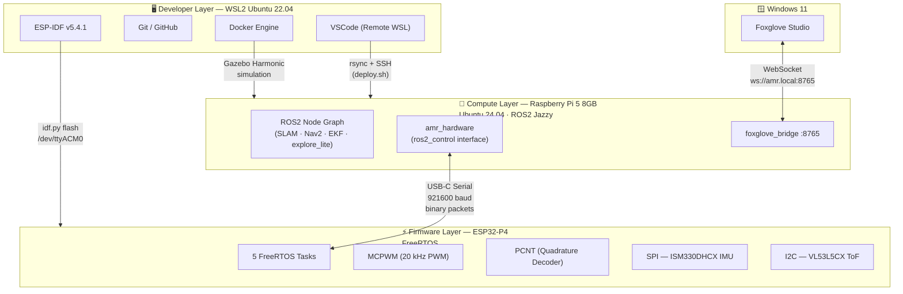

**Why this split?**
- **ESP32-P4**: Hard real-time requirements (1 kHz PID loop) cannot run on Linux. The ESP32's FreeRTOS gives deterministic scheduling with no jitter from OS preemption.
- **Raspberry Pi 5**: SLAM, path planning, and sensor fusion are computationally intensive but latency-tolerant. RPi5 8GB handles colcon builds natively — no cross-compilation needed.
- **WSL2**: Full Linux toolchain (ESP-IDF, ROS2 CLI, Docker) on a Windows development machine.

---

## 2. Firmware — ESP32-P4

### 2.1 FreeRTOS Task Design

Five tasks run concurrently. Real-time tasks are isolated on Core 0; all I/O tasks run on Core 1. This prevents I2C/SPI bus stalls from delaying the PID control loop.

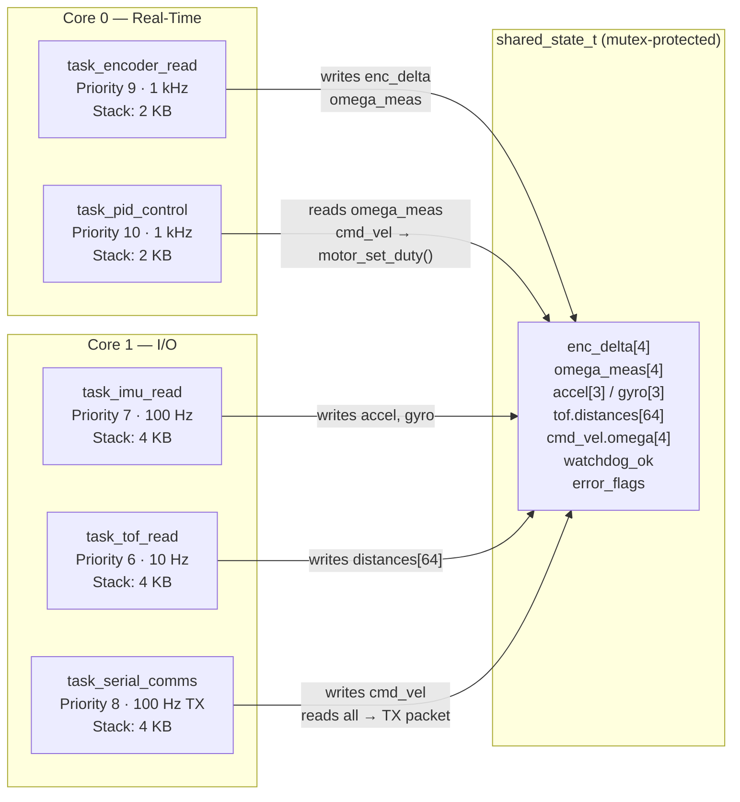

**Entry point — `main.c`:**
```c
void app_main(void) {
    memset(&g_state, 0, sizeof(g_state));
    g_state.mutex = xSemaphoreCreateMutex();

    encoder_init();
    motor_init();
    ism330dhcx_init();
    vl53l5cx_drv_init();

    xTaskCreatePinnedToCore(task_encoder_read, "enc_read",  2048, NULL, 9,  NULL, 0);
    xTaskCreatePinnedToCore(task_pid_control,  "pid_ctrl",  2048, NULL, 10, NULL, 0);
    xTaskCreatePinnedToCore(task_imu_read,     "imu_read",  4096, NULL, 7,  NULL, 1);
    xTaskCreatePinnedToCore(task_tof_read,     "tof_read",  4096, NULL, 6,  NULL, 1);
    xTaskCreatePinnedToCore(task_serial_comms, "serial_comms", 4096, NULL, 8, NULL, 1);

    vTaskDelete(NULL);  // main task self-destructs; tasks run forever
}
```

**Priority rationale:**
| Priority | Task | Why |
|---|---|---|
| 10 | PID control | Must never be preempted mid-cycle |
| 9 | Encoder read | PID depends on fresh encoder data |
| 8 | Serial comms | Heartbeat watchdog must respond reliably |
| 7 | IMU read | 100 Hz; some latency acceptable |
| 6 | ToF read | 10 Hz; lowest urgency |

---

### 2.2 MCPWM Motor Driver

**Why MCPWM and not LEDC?**

The design originally used LEDC (LED Control) for PWM generation. During hardware bring-up, `ledc_channel_config()` for any channel ≥ 1 triggered a deferred AHB bus fault on ESP32-P4 rev v1.3 with ESP-IDF 5.4.1. The RISC-V store buffer held the faulting write to LEDC GAMMA_RAM and delivered the exception at the *next* AHB access — which happened to be a `gpio_config()` call — causing a silent hang mid-log-print. MCPWM has no GAMMA_RAM and does not exhibit this bug.

**MCPWM configuration:**

```
Frequency:  20 kHz   (inaudible, above motor inductance corner frequency)
Resolution: 10 MHz clock → 500 ticks full scale
Duty range: 0–500 ticks (0% to 100%)
```

**Motor → MCPWM group mapping:**
```
Motors 0, 1, 2 → MCPWM Group 0 (operators 0, 1, 2)
Motor 3        → MCPWM Group 1 (operator 0)
```
This is because MCPWM Group 0 supports only 3 operators on ESP32-P4.

**Actual GPIO assignments (from `motor.c`):**
```c
static const int PWM_GPIO[] = {5, 34, 35, 45};  // FL FR RL RR
static const int DIR_GPIO[] = {26, 27, 20, 21};  // FL FR RL RR
```

**Sign-magnitude control:**
```c
void motor_set_duty(int idx, float duty) {
    // duty in [-1.0, 1.0]
    gpio_set_level(DIR_GPIO[idx], duty >= 0.0f ? 1 : 0);  // direction
    mcpwm_comparator_set_compare_value(s_cmpr[idx],
        (uint32_t)(fabsf(duty) * PWM_PERIOD));              // magnitude
}
```

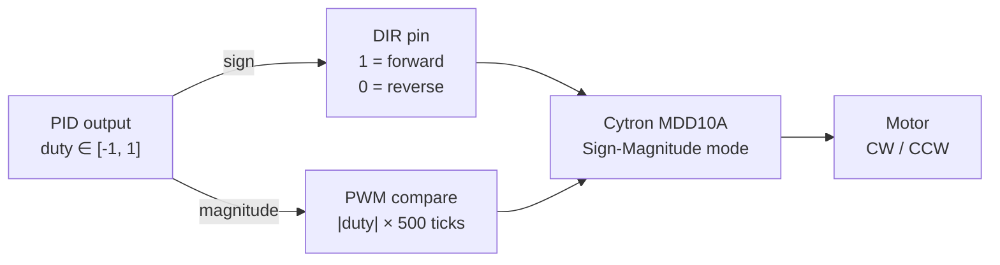

---

### 2.3 Quadrature Encoder Decoding

The ME-37 encoders are 7 PPR (pulses per revolution) on the motor shaft. With quadrature decoding (4 edges per pulse) and the gear ratio:

```
Counts per output shaft revolution = 7 × 4 × gear_ratio
```

> **Note:** The spec lists a 13.7:1 gear (PG36M555-13.7K). The actual firmware uses `RAD_PER_COUNT` calculated for a **19.2:1 gear** (commit 67c6c31), giving 537.6 counts/rev. Verify the physical gear ratio before adjusting.

```c
// task_encoder_read.c
#define RAD_PER_COUNT (2.0f * 3.14159265f / 537.6f)  // for 19.2:1 gear

// Each 1 ms tick: convert count delta to rad/s
g_state.omega_meas[i] = d[i] * RAD_PER_COUNT * 1000.0f;
```

**ESP32-P4 PCNT (Pulse Counter) — Quadrature mode:**

```c
// encoder.c — actual GPIO assignments
static const int GPIO_A[] = {48, 49, 50, 51};  // FL FR RL RR channel A
static const int GPIO_B[] = {52,  2,  3,  4};  // FL FR RL RR channel B
```

Each encoder unit has two PCNT channels — one triggered on A-edges (using B as level), one triggered on B-edges (using A as level). This gives full 4× quadrature resolution and correct direction sensing:

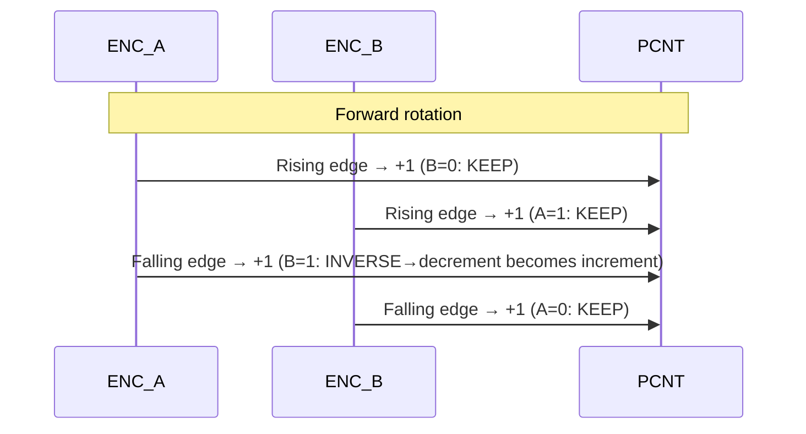

`encoder_get_deltas()` is thread-safe (mutex-protected), returns the delta since last call, and resets the baseline atomically.

---

### 2.4 PID Velocity Controller

Each of the 4 wheels has an independent discrete PID controller running at 1 kHz (dt = 0.001 s).

```
Kp = 2.0   Ki = 5.0   Kd = 0.01
Output range: [-1.0, 1.0] (motor duty)
```

**Anti-windup:** The integrator only accumulates when the output is within bounds (not saturated). This prevents integral windup when the motor is at full throttle.

```c
// pid.c
float pid_update(pid_t *p, float sp, float meas) {
    float e = sp - meas;
    float d = (e - p->prev_error) / p->dt;
    p->prev_error = e;

    float out = p->kp * e + p->ki * p->integral + p->kd * d;

    // Anti-windup: only integrate when not saturated
    if (out > p->out_min && out < p->out_max)
        p->integral += e * p->dt;

    // Clamp output
    if (out > p->out_max) out = p->out_max;
    if (out < p->out_min) out = p->out_min;
    return out;
}
```

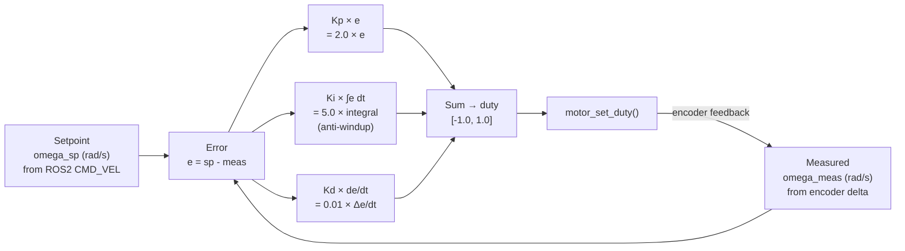

**Gains can be updated at runtime** via `0x05 PARAM_SET` packets — no reflash needed for tuning.

---

### 2.5 Serial Protocol

All communication between the RPi5 (`amr_hardware` node) and the ESP32 uses a binary framed protocol over USB-CDC at **921600 baud**.

**Frame format:**
```
[0xAA][0x55][TYPE:1][LEN:1][PAYLOAD:LEN bytes][CRC16_HI][CRC16_LO]
```
CRC-16/ARC computed over `TYPE + LEN + PAYLOAD`.

**Packet types:**

| Type | Direction | Rate | Description | Size |
|---|---|---|---|---|
| `0x01` CMD_VEL | RPi5 → MCU | on demand | 4× wheel ω (rad/s) as float32 | 22 B |
| `0x02` STATE | MCU → RPi5 | 100 Hz | timestamp + 4× enc_delta + accel[3] + gyro[3] | 50 B |
| `0x03` TOF_DATA | MCU → RPi5 | 10 Hz | 64× uint16 distances (mm), 8×8 grid | 134 B |
| `0x04` HEARTBEAT | RPi5 → MCU | 1 Hz | Empty payload — keeps watchdog alive | 6 B |
| `0x05` PARAM_SET | RPi5 → MCU | on demand | param_id + float value — live PID tuning | 11 B |
| `0x06` DIAGNOSTICS | MCU → RPi5 | 1 Hz | battery_mv + error_flags | 9 B |

**C structs (packed, no padding):**
```c
typedef struct __attribute__((packed)) {
    uint32_t timestamp_ms;
    int32_t  enc_delta[4];  // FL FR RL RR counts since last packet
    float    accel[3];      // m/s²
    float    gyro[3];       // rad/s
} proto_state_t;            // 44 bytes payload

typedef struct __attribute__((packed)) {
    uint16_t distances[64]; // mm, row-major 8×8
} proto_tof_t;              // 128 bytes payload

typedef struct __attribute__((packed)) {
    float omega[4];         // FL FR RL RR rad/s setpoints
} proto_cmd_vel_t;          // 16 bytes payload
```

**Bandwidth analysis:**
```
STATE   @ 100 Hz = 50 B × 100   = 5,000 B/s
TOF     @ 10 Hz  = 134 B × 10   = 1,340 B/s
Total uplink                     = 6,340 B/s

921600 baud ≈ 92,160 B/s capacity
Utilization: 6.9%  ← ample headroom
```

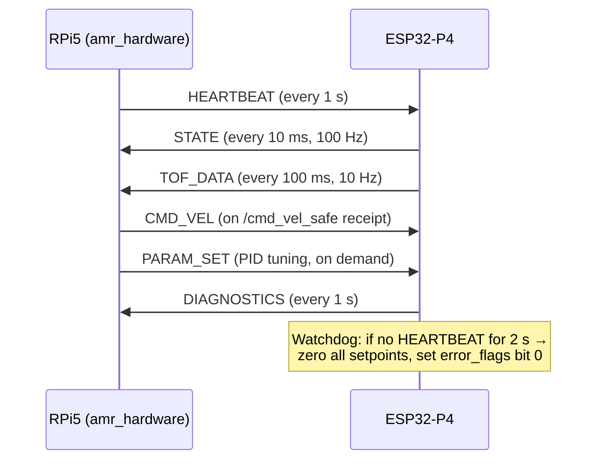

---

### 2.6 Shared State & Watchdog

All five tasks communicate through a single `shared_state_t` struct protected by a FreeRTOS mutex. No task writes directly to hardware from another task's context.

```c
typedef struct {
    proto_state_t   state;       // encoder deltas + IMU readings
    proto_tof_t     tof;         // 8×8 distance grid
    proto_cmd_vel_t cmd_vel;     // wheel velocity setpoints from ROS2
    float           omega_meas[4]; // measured wheel speeds (rad/s)
    uint8_t         error_flags; // bit 0 = watchdog timeout
    bool            watchdog_ok; // true if heartbeat received within 2 s
    SemaphoreHandle_t mutex;
} shared_state_t;
```

**Watchdog logic (task_serial_comms.c):**
```c
bool ok = (now - s_last_hb_ms) < 2000;  // 2-second timeout
g_state.watchdog_ok = ok;
g_state.error_flags = ok ? (flags & ~0x01) : (flags | 0x01);
```

When `watchdog_ok` is false, `task_pid_control` calls `motor_stop_all()` — a hardware-level E-stop independent of ROS2 state.

---

## 3. ROS2 Stack — Raspberry Pi 5

**OS:** Ubuntu 24.04 · **ROS2:** Jazzy Jalisco (LTS)

### 3.1 Package Structure

```
ros2_ws/src/
├── amr_description/      # URDF, sensor frames, Gazebo plugins
│   └── urdf/amr.urdf.xacro   # sim/real switch via use_sim arg
│
├── amr_hardware/         # ros2_control SystemInterface
│   ├── amr_hardware_interface.cpp  # reads STATE packets, writes CMD_VEL
│   └── vl53l5cx_converter.cpp      # 8×8 distances → PointCloud2 (inline)
│
├── amr_bringup/          # Launch files + top-level configs
│   ├── launch/amr.launch.py        # real hardware
│   ├── launch/sim.launch.py        # simulation
│   └── config/
│       ├── ekf.yaml                # robot_localization EKF params
│       ├── controllers.yaml        # mecanum_drive_controller params
│       └── nav2_params.yaml        # Nav2 full config
│
├── amr_navigation/       # Nav2 params, costmaps, lattice
│   └── config/lattice/output.json  # precomputed holonomic motion primitives
│
├── amr_slam/             # slam_toolbox params
│   └── config/slam_toolbox.yaml
│
├── amr_exploration/      # Exploration logic
│   ├── amr_home_manager.py         # custom lifecycle node
│   └── config/explore_lite.yaml
│
├── sllidar_ros2/         # Slamtec LiDAR driver (cloned)
└── m-explore-ros2/       # explore_lite for ROS2 (cloned — NOT in Jazzy apt)
```

**Why `m-explore-ros2` is built from source:** The `explore_lite` package is not available as a binary apt package for ROS2 Jazzy. It must be cloned into the workspace and built with colcon.

---

### 3.2 Full Node Graph

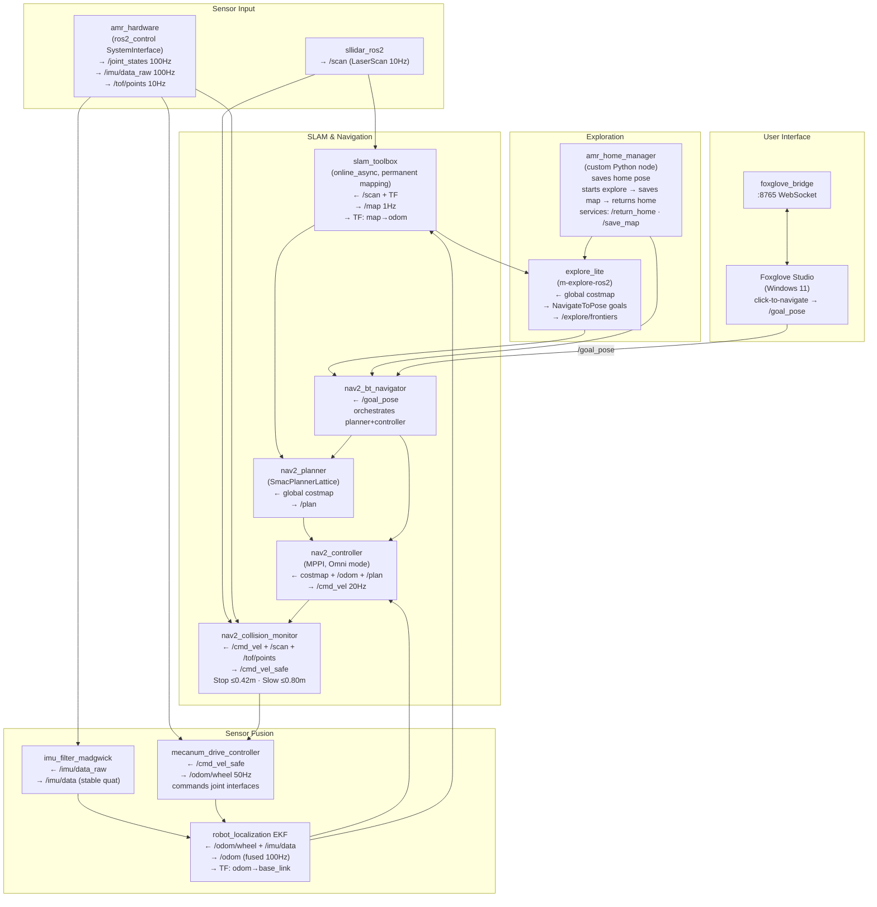

**Why each node exists:**

| Node | Package | Why this choice |
|---|---|---|
| `sllidar_ros2` | slamtec official | Only ROS2 driver for C1M1 R2 |
| `amr_hardware` | custom | ros2_control interface; abstracts serial protocol |
| `mecanum_drive_controller` | ros2_controllers | Official package; handles mecanum kinematics + odometry |
| `imu_filter_madgwick` | imu_tools | Fuses accel+gyro into stable orientation before EKF |
| `robot_localization` | ros-jazzy-robot-localization | Industry-standard EKF for robot pose fusion |
| `slam_toolbox` | ros-jazzy-slam-toolbox | Best open-source SLAM for ROS2; loop closure; permanent mapping |
| `nav2_collision_monitor` | Nav2 | Operates on raw sensor data, faster than costmap cycle — last safety line |
| `SmacPlannerLattice` | Nav2 | Only Nav2 planner that generates holonomic motion primitives |
| `MPPI (Omni)` | Nav2 | Best smooth trajectory tracking for holonomic robots in Nav2 |
| `explore_lite` | m-explore-ros2 | Lightweight frontier exploration; Nav2-native API |
| `amr_home_manager` | custom | Coordinates full mission: record home → explore → save map → return |
| `foxglove_bridge` | ros-jazzy-foxglove-bridge | Live visualization + click-to-navigate from Windows |

---

### 3.3 Topic Reference

| Topic | Type | Hz | Producer | Key Consumers |
|---|---|---|---|---|
| `/scan` | LaserScan | 10 | sllidar_ros2 | slam_toolbox, costmaps, collision_monitor |
| `/imu/data_raw` | Imu | 100 | amr_hardware | imu_filter_madgwick |
| `/imu/data` | Imu | 100 | imu_filter_madgwick | robot_localization |
| `/joint_states` | JointState | 100 | amr_hardware | mecanum_drive_controller |
| `/odom/wheel` | Odometry | 50 | mecanum_drive_controller | robot_localization |
| `/odom` | Odometry | 100 | robot_localization | Nav2, MPPI |
| `/tof/points` | PointCloud2 | 10 | amr_hardware | local costmap, collision_monitor |
| `/map` | OccupancyGrid | 1 | slam_toolbox | global costmap, explore_lite |
| `/cmd_vel` | Twist | 20 | MPPI controller | collision_monitor |
| `/cmd_vel_safe` | Twist | 20 | collision_monitor | mecanum_drive_controller |
| `/goal_pose` | PoseStamped | event | Foxglove user | bt_navigator |
| `/explore/frontiers` | MarkerArray | 0.33 | explore_lite | Foxglove (visual) |
| `/exploration_complete` | Bool | event | amr_home_manager | Foxglove (status) |
| `/home_pose` | PoseStamped | 1 | amr_home_manager | Foxglove (marker) |

---

### 3.4 TF Tree

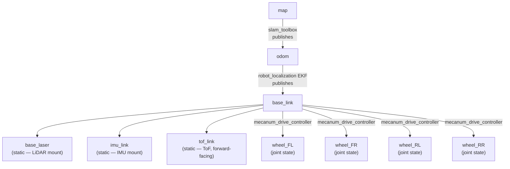

Each TF edge has **exactly one publisher**. No conflicts. The `map→odom` edge is slam_toolbox's loop-closure correction; `odom→base_link` is the EKF's continuous pose estimate.

---

## 4. Sensor Fusion & Localization

Two-stage fusion pipeline:

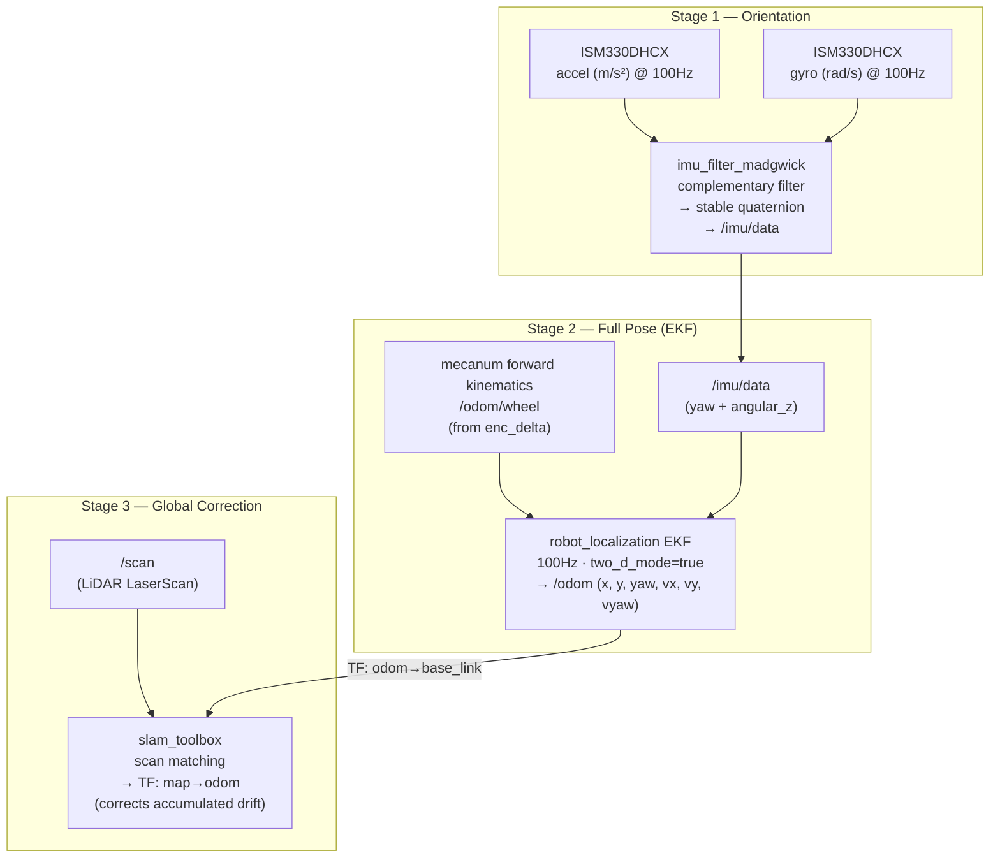

**Mecanum forward kinematics** (in `mecanum_drive_controller`):
```
Given: ωFL, ωFR, ωRL, ωRR  [rad/s, signed]
       r  = 0.030 m  (wheel radius)
       lx = half-wheelbase (front-to-rear axle / 2)
       ly = half-track    (left-to-right / 2)

vx = (r/4) × ( ωFL + ωFR + ωRL + ωRR)   ← forward velocity
vy = (r/4) × (-ωFL + ωFR + ωRL - ωRR)   ← lateral velocity
ωz = (r / (4×(lx+ly))) × (-ωFL + ωFR - ωRL + ωRR)  ← yaw rate
```

**EKF state vector** (two_d_mode, planar):
```
[x, y, yaw, vx, vy, vyaw]
```

**EKF input fusion:**
- `/odom/wheel` → x, y, yaw, vx, vy, vyaw (full odometry)
- `/imu/data` → yaw, vyaw only (avoids double-counting)

**Why disable the magnetometer?** The MMC5983MA magnetometer is intentionally unused. DC motor currents generate strong, dynamic magnetic fields that corrupt indoor magnetometer readings, making heading estimates from the magnetometer unreliable. Yaw is instead derived from gyro integration (Madgwick filter) corrected by LiDAR scan matching.

---

## 5. SLAM

**Package:** `slam_toolbox` — online_async mode  
**Strategy:** Permanent mapping — the map never freezes. slam_toolbox continuously adds scan poses and runs loop closure in the background throughout the entire mission.

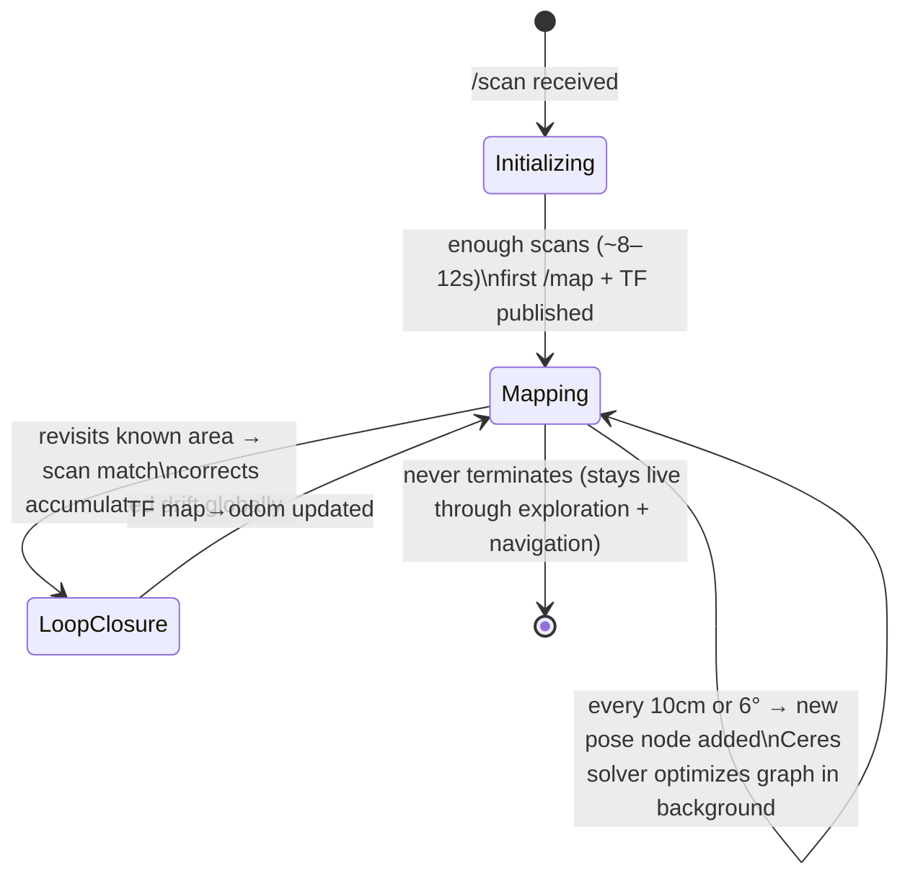

**Key config choices:**

| Parameter | Value | Why |
|---|---|---|
| `resolution` | 0.05 m | 5 cm/cell resolves doorways clearly |
| `max_laser_range` | 12.0 m | C1M1 R2 rated range |
| `minimum_travel_distance` | 0.10 m | Adds pose node after 10 cm — dense enough for accuracy |
| `minimum_travel_heading` | 0.10 rad | ~6° rotation also triggers new node |
| `do_loop_closing` | true | Eliminates drift when robot revisits areas |
| `solver_plugin` | CeresSolver + SPARSE_NORMAL_CHOLESKY | Best accuracy/speed for indoor SLAM |
| `use_multithread_scheduler` | true | Uses RPi5 cores for background Ceres solving |

**Map saving** (called by `amr_home_manager` on exploration complete):
```bash
ros2 run nav2_map_server map_saver_cli \
  -f ~/maps/$(date +%Y%m%d_%H%M%S) \
  --ros-args -p save_map_timeout:=5.0
```
Outputs: `<timestamp>.pgm` (grayscale bitmap) + `<timestamp>.yaml` (origin, resolution, metadata).

---

## 6. Navigation Stack

### 6.1 Global Planner — SmacPlannerLattice

**Why SmacPlannerLattice?** It is the only Nav2 planner designed for holonomic robots. NavFn and SmacPlanner2D treat the robot as differential-drive and ignore lateral motion. SmacPlannerLattice uses precomputed motion primitives (forward, strafe, diagonal, rotate-in-place) that exploit the mecanum wheels' full capability.

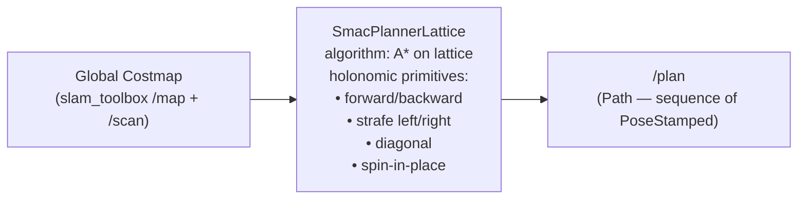

**Lattice file generation** (run once, commit `output.json`):
```bash
ros2 run nav2_smac_planner generate_lattice \
  --config-filepath amr_navigation/config/lattice_gen.yaml \
  --output-filepath amr_navigation/config/lattice/output.json
```

Lattice config:
```yaml
minimum_turning_radius: 0.0    # mecanum can turn in place
allow_reverse_motion: true
n_orientations: 16             # 22.5° heading resolution
motion_model: "omni"
turning_radii: [0.0, 0.4, 0.8, 1.2, 1.8]
```

---

### 6.2 Local Controller — MPPI

**Why MPPI?** Model Predictive Path Integral controller samples 2000 trajectory rollouts per 50ms cycle and picks the statistically optimal one. `motion_model: Omni` enables full (vx, vy, ωz) control — essential for mecanum. MPPI produces smooth, holonomic trajectories that NavFn/DWB cannot match.

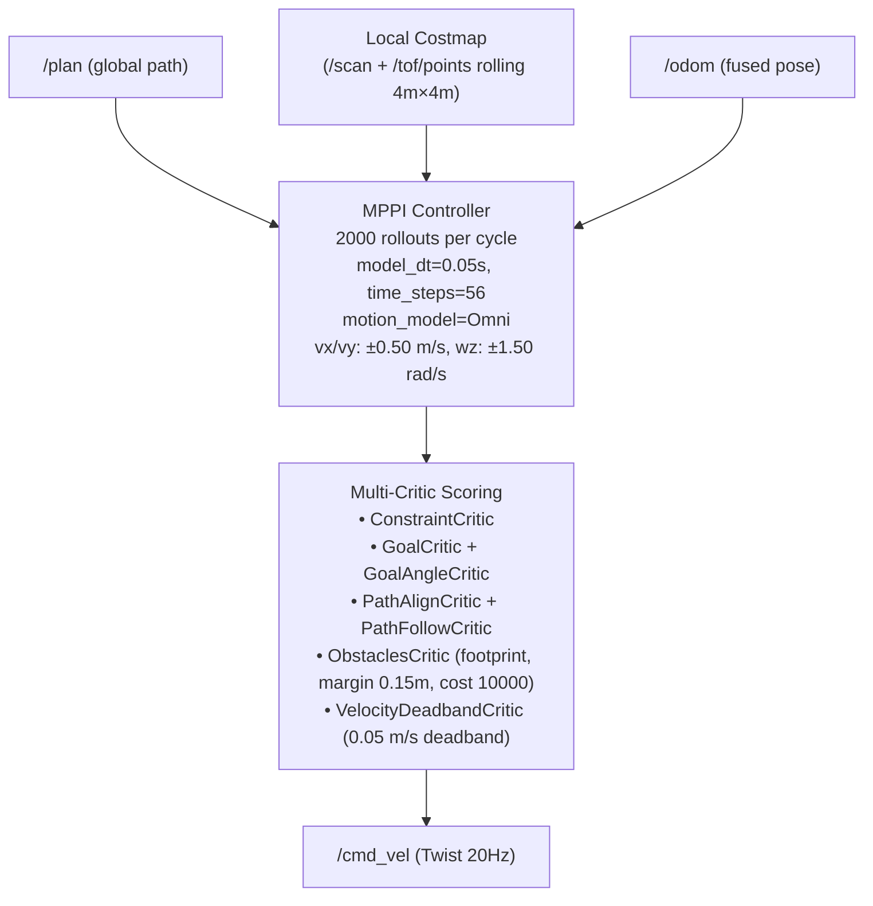

**VelocityDeadbandCritic** prevents jitter near the goal by adding cost to velocities below 0.05 m/s — the robot commits to stop rather than oscillating.

---

### 6.3 Collision Monitor

The collision monitor sits between MPPI output (`/cmd_vel`) and the hardware (`/cmd_vel_safe`). It operates directly on raw sensor data at 20 Hz — faster than the costmap update cycle. It provides a safety guarantee even if Nav2 produces a bad velocity command.

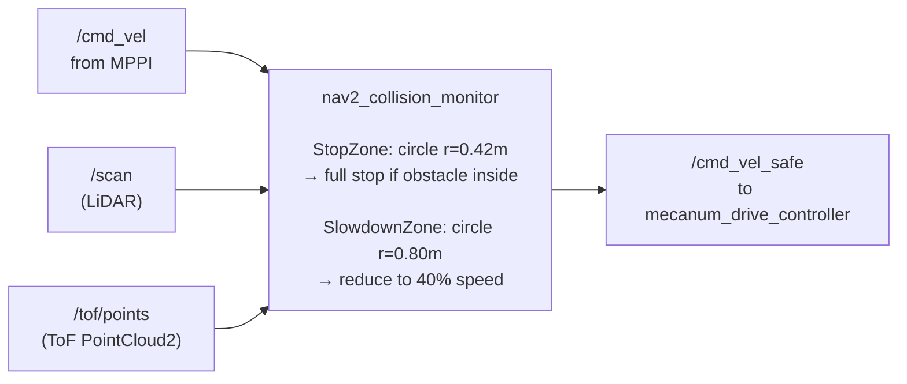

**Why two sensors?** LiDAR misses obstacles below its scan plane (chair legs, cables, threshold strips). The VL53L5CX ToF sensor covers the 2–50 cm height band, catching objects LiDAR cannot see.

---

### 6.4 Recovery Behaviors

Standard Nav2 behavior tree:
```
navigate → obstacle detected
  → backup(0.3m)
  → spin(1.57 rad)
  → retry navigate
  → (after 3 retries) wait(3s) → retry
```
Plugins: `spin`, `backup`, `drive_on_heading`, `wait`.

---

## 7. Autonomous Exploration

### 7.1 explore_lite (frontier-based)

`explore_lite` (from `m-explore-ros2`) implements greedy frontier exploration. It scans the global costmap for frontier cells — boundaries between known free space and unknown space — ranks them by a gain function, and sends the best frontier as a `NavigateToPose` goal.

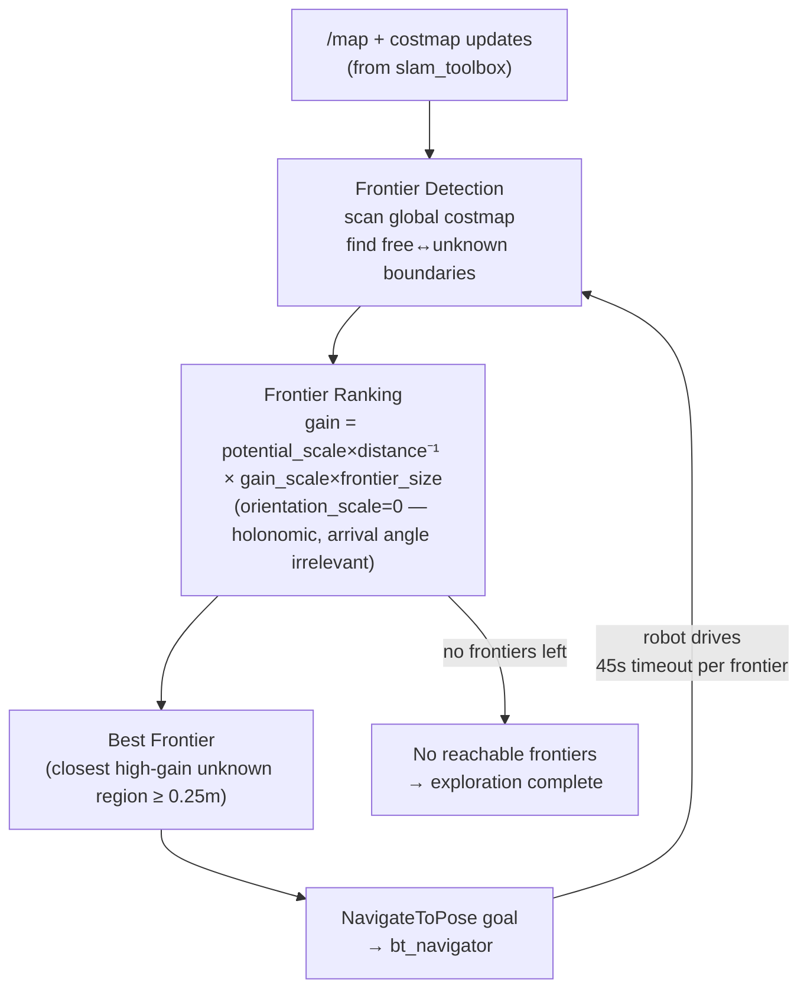

**Key config:**
```yaml
planner_frequency: 0.33       # recompute best frontier every 3s
progress_timeout: 45.0        # abandon stuck frontier after 45s
potential_scale: 3.0          # prefer closer frontiers
orientation_scale: 0.0        # holonomic — arrival orientation irrelevant
min_frontier_size: 0.25       # ignore micro-frontiers near walls
use_nav2_api: true
```

---

### 7.2 amr_home_manager State Machine

Custom Python lifecycle node in `amr_exploration/`. Coordinates the full autonomous mission.

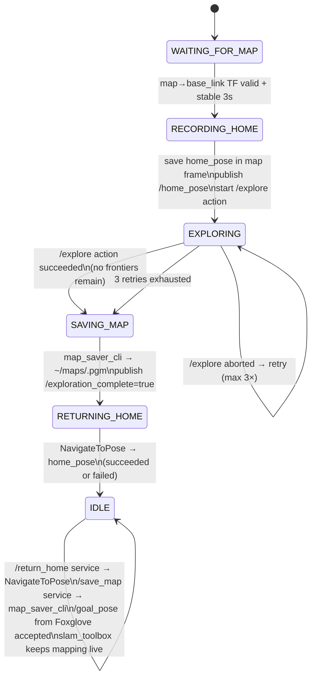

**Services exposed in IDLE state:**
- `/return_home` (`std_srvs/Trigger`) — navigate back to saved home pose
- `/save_map` (`std_srvs/Trigger`) — save current map snapshot

---

### 7.3 Full Operational Lifecycle

```
T+0s     Power on
         ESP32 boots FreeRTOS, all tasks start within 2s
         RPi5 systemd amr.service launches all ROS2 nodes

T+2s     /scan live (sllidar_ros2)
         /imu/data_raw + /tof/points live (amr_hardware serial link established)

T+8–12s  slam_toolbox accumulates enough scans
         → first /map published + TF: map→odom valid

T+12s    amr_home_manager: home pose recorded
         → /explore action started
         → Foxglove on Windows: connect → full live view available

T+12s → exploration complete:
  explore_lite selects best frontier (closest high-gain unknown cell)
  SmacPlannerLattice plans holonomic path through known space
  MPPI executes smooth trajectory (2000 rollouts per 50ms)
  collision_monitor enforces 0.42m stop / 0.80m slowdown safety zones
  slam_toolbox closes loops → map sharpens as areas revisited
  New frontier selected every 3s → robot advances
  ↑ Repeat until no reachable frontiers

Exploration complete:
  amr_home_manager saves map snapshot to ~/maps/<timestamp>.pgm/.yaml
  Publishes /exploration_complete = true
  Navigates back to home_pose

IDLE (indefinite):
  slam_toolbox keeps map live — map continues updating
  User connects Foxglove → sees complete map
  User clicks on 3D panel → /goal_pose published → bt_navigator executes
  collision_monitor active throughout
  Repeat for any number of goals
```

---

## 8. Simulation

Full Gazebo Harmonic warehouse simulation running on WSL2 via Docker — the identical ROS 2 Jazzy stack as the real robot, single command launch, used for the CV portfolio demo.

### 8.1 Launch

```bash
./scripts/demo_sim.sh
# Builds amr_sim:latest Docker image if missing
# Clones explore_lite from source if missing (not in Jazzy apt)
# colcon builds the workspace
# Launches Gazebo + full ROS 2 stack inside Docker
# Gazebo and RViz2 windows appear on Windows via WSLg X11 forwarding
```

### 8.2 Architecture

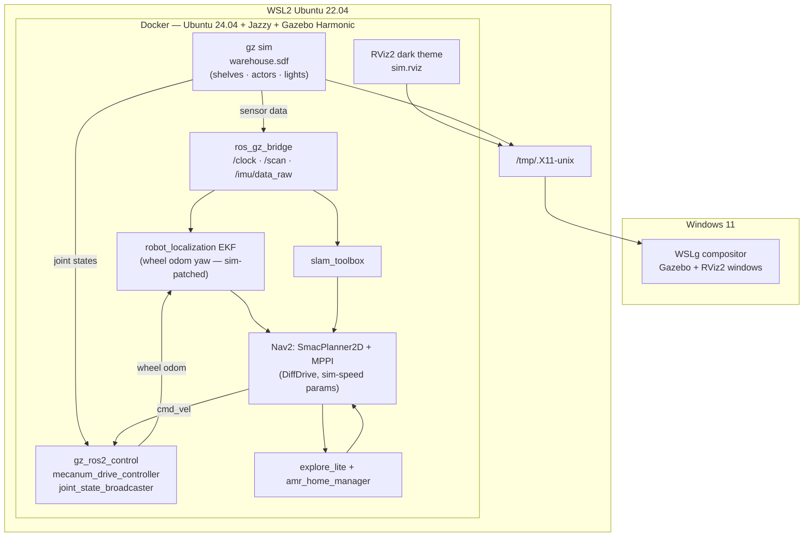

### 8.3 Sim-to-real boundary

A single URDF xacro `if/unless` switches the `ros2_control` hardware plugin:

```xml
<ros2_control name="AMRSystem" type="system">
  <hardware>
    <xacro:if value="$(arg use_sim)">
      <plugin>gz_ros2_control/GazeboSimSystem</plugin>
    </xacro:if>
    <xacro:unless value="$(arg use_sim)">
      <plugin>amr_hardware/AMRHardwareInterface</plugin>
      <param name="serial_port">/dev/amr_mcu</param>
    </xacro:unless>
  </hardware>
</ros2_control>
```

Everything above `ros2_control` (Nav2, SLAM, EKF, explore_lite, collision_monitor) is 100% identical between simulation and real hardware.

### 8.4 Runtime-only sim overrides

`sim.launch.py` patches YAML configs in-memory at launch time via `OpaqueFunction`. The source YAML files (tuned for real hardware) are never modified.

**EKF yaw patch** — Madgwick 6-DoF can't correct yaw drift without a magnetometer. In sim the IMU noise integrates without bound. Wheel odometry is perfect in Gazebo physics, so the EKF is switched to use wheel odom for yaw at runtime:

```python
params['odom0_config'][5]  = True   # yaw from wheel odom
params['odom0_config'][11] = True   # vyaw from wheel odom
params['imu0_config'][5]   = False  # yaw from IMU disabled
params['imu0_config'][11]  = False  # vyaw from IMU disabled
```

**Nav2 sim params** — `DiffDrive` MPPI rotates before translating; the progress checker fired during rotation (position unchanged). Real-hardware conservatism also unnecessary in perfect-physics sim:

| Parameter | Real robot | Sim |
|---|---|---|
| `required_movement_radius` | 0.5 m | 0.20 m |
| `movement_time_allowance` | 10 s | 30 s |
| `vx_max` | 0.10 m/s | 0.35 m/s |
| `wz_max` | 0.4 rad/s | 1.0 rad/s |
| `inflation_radius` | 0.45 m | 0.30 m |

### 8.5 Warehouse world

`ros2_ws/src/amr_description/worlds/warehouse.sdf`:
- 20×20 m floor + 4 walls, no ceiling
- 15 shelves (2 rows × 3 m aisle spacing), 5 boxes, 6 pallets, 4 pillars, 1 forklift
- 6 overhead point-light fixtures
- 7 yellow safety floor stripes
- 3 walking human actors (Fuel mesh `walk.dae`, scripted waypoint trajectories)

---

## 9. Development Workflow

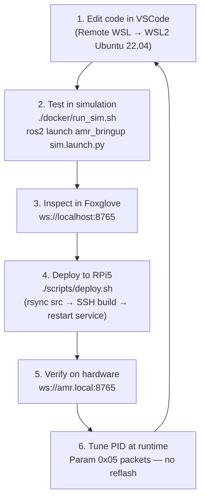

**deploy.sh** (actual script):
```bash
#!/bin/bash
set -e
RPI="ubuntu@amr.local"

rsync -avz --delete ~/amr/ros2_ws/src/ $RPI:~/amr_ws/src/

ssh $RPI "
  source /opt/ros/jazzy/setup.bash &&
  cd ~/amr_ws &&
  colcon build --symlink-install \
    --cmake-args -DCMAKE_BUILD_TYPE=Release \
    2>&1 | tail -30
"

ssh $RPI "sudo systemctl restart amr.service 2>/dev/null || echo 'Service not yet installed'"
```

**RPi5 systemd service** (auto-start on power-on):
```ini
[Unit]
Description=AMR ROS2 Stack
After=network.target

[Service]
Type=simple
User=ubuntu
ExecStart=/bin/bash -c \
  "source /opt/ros/jazzy/setup.bash && \
   source /home/ubuntu/amr_ws/install/setup.bash && \
   ros2 launch amr_bringup amr.launch.py"
Restart=on-failure
RestartSec=5
```

Power on → ~15 seconds → full stack running → Foxglove ready. No SSH required.

**Firmware flash** (from WSL2):
```bash
cd ~/amr/firmware
idf.py set-target esp32p4
idf.py build
idf.py -p /dev/ttyACM0 flash monitor
```

**Network:**
```
Development: Ethernet RPi5 ↔ router, static IP 192.168.1.100, hostname amr.local
Deployment:  RPi5 on home WiFi, same static IP, same hostname
ROS_DOMAIN_ID=42  (isolates from other ROS2 traffic on the network)
```

---

## 10. Teleop — Manual Control

`teleop/teleop.py` runs on the RPi5 (or any machine with serial access) and implements arrow-key control over the same binary serial protocol used by `amr_hardware`.

**Mecanum inverse kinematics** (in the teleop script):
```python
def mecanum_ik(vx, vy, wz):
    """Return (FL, FR, RL, RR) wheel angular velocities in rad/s."""
    r = 0.030   # wheel radius
    L = 0.30    # wheelbase sum (lx + ly)
    fl = (1/r) * (vx - vy - L * wz)
    fr = (1/r) * (vx + vy + L * wz)
    rl = (1/r) * (vx + vy - L * wz)
    rr = (1/r) * (vx - vy + L * wz)
    return fl, fr, rl, rr
```

**Key bindings:**
| Key | vx | vy | wz | Motion |
|---|---|---|---|---|
| ↑ | +0.30 m/s | 0 | 0 | Forward |
| ↓ | -0.30 m/s | 0 | 0 | Backward |
| ← | 0 | +0.30 m/s | 0 | Strafe left |
| → | 0 | -0.30 m/s | 0 | Strafe right |
| Q/q | 0 | 0 | +1.2 rad/s | Rotate CCW |
| E/e | 0 | 0 | -1.2 rad/s | Rotate CW |
| Space | 0 | 0 | 0 | Stop |
| Esc | — | — | — | Quit (sends stop packet) |

Teleop sends CMD_VEL at 20 Hz and HEARTBEAT at 1 Hz. On exit it sends a zero CMD_VEL to stop the robot. The watchdog on the ESP32 will also stop the robot within 2 seconds if teleop crashes or loses serial connection.

```bash
# Usage (on RPi5)
python3 teleop/teleop.py --port /dev/amr_mcu --baud 921600
```

---

*This document reflects the actual implemented code as of the current commit. GPIO assignments, motor driver, and encoder parameters are derived from source files, not the original spec.*
